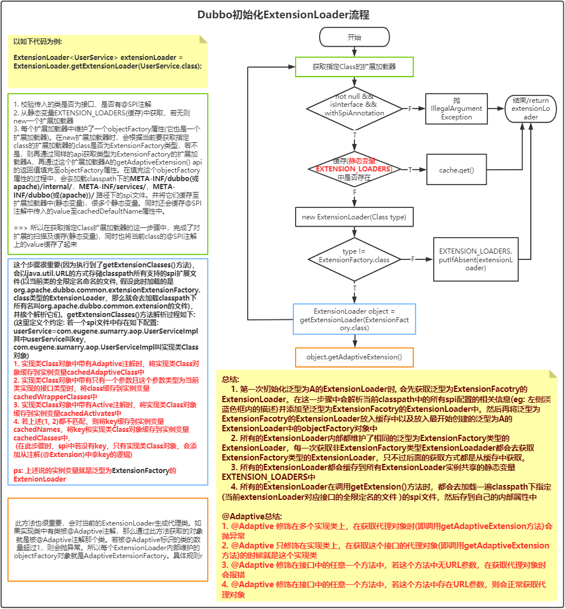

# Dubbo 功能点

## 一、SPI相关功能点

### 1.1 AOP

* aop的实现原理比较简单，都是通过**ExtensionLoader**的**injectionExtension**方法完成的，只需要在spi文件中配置wrapper类即可(**所谓wrapper类就是当前实现类中存在一个带一个参数构造方法，且此构造方法的参数类型就是接口类型**)。具体有如下几个条件:

  ```txt
  1. 接口要添加@SPI注解
  2. spi中配置的实现类中要有wrapper类
  3. 实现类中要有带参构造方法，且参数为接口的类型
  ```

* **注意点:**: 若有多个wrapper类，则会递归的包装，按照spi文件中配置的顺序，**下面**的wrapper包装**上面**的wrapper，即下面的代理上面的

* 写一个例子:

  1. UserService.java类

     ```java
     package com.eugene.sumarry.aop;
     
     import org.apache.dubbo.common.extension.SPI;
     
     @SPI
     public interface UserService {
     
         void findUsers();
     }
     ```

  2. UserServiceImpl.java类

     ```java
     package com.eugene.sumarry.aop;
     
     public class UserServiceImpl implements UserService {
     
         @Override
         public void findUsers() {
             System.out.println("find users");
         }
     }
     ```

  3. UserServiceProxy1.java类

     ```java
     package com.eugene.sumarry.aop;
     
     import org.apache.dubbo.common.extension.Adaptive;
     
     public class UserServiceImplProxy1 implements UserService {
     
         private UserService userService;
     
         public UserServiceImplProxy1(UserService userService) {
             this.userService = userService;
         }
     
         @Override
         public void findUsers() {
             System.out.println("before");
             userService.findUsers();
             System.out.println("after");
         }
     }
     ```

  4. UserServiceProxy2.java类

     ```
     package com.eugene.sumarry.aop;
     
     public class UserServiceImplProxy2 implements UserService {
     
         private UserService userService;
     
         public UserServiceImplProxy2(UserService userService) {
             this.userService = userService;
         }
     
         @Override
         public void findUsers() {
             System.out.println("before");
             userService.findUsers();
             System.out.println("after");
         }
     }
     
     ```

     

  5. **com.eugene.sumarry.aop.UserService**文件

     ```properties
     userService=com.eugene.sumarry.aop.UserServiceImpl
     userServiceProxy1=com.eugene.sumarry.aop.UserServiceImplProxy1
     userServiceProxy2=com.eugene.sumarry.aop.UserServiceImplProxy2
     ```

  6. 通过**ExtensionLoader.getExtensionLoader(UserService.class).getExtension("userService")**获取的UserService对象是被包装了三层的**UserServiceImpl**对象，最外面一层为: **UserServiceImplProxy2**, 其次为**UserServiceImplProxy1**, 最里面为自身**UserServiceImpl**。但要注意，如果我们要单独获取**UserServiceImplProxy1**对象时是获取不到的，因为dubbo只支持从**cachedClasses**属性中去找name，而只有实现类中无@Adaptive注解、无@Active注解、非包装类的情况下，它在spi配置的name才会被加载到**cachedClasses**中 ===> 白话理解就是：普通类才会添加到**cachedClasses**中去

### 1.2 IOC

* ioc的实现比较麻烦，需要依赖`@Adaptive`注解和`URL`参数. 具体规则如下:

  ```txt
  1. 接口中要有@SPI注解
  2. 在spi文件中添加的实现类中，实现类依赖于当前接口类型的属性，且对这个属性有set方法(使用dubbo的SpiExtensionLoader来生成代理类的话，那这个set方法名叫什么都没关系，只要参数类型是接口类型就ok了)
  3. 接口中只要有一个方法存在@Adaptive注解即可完成注入
  4. 被@Adaptive标识的方法中都要有一个叫URL的属性，若没有会抛异常
  ```

* 写一个例子:

  1. IndexService.java类

     ```java
     package com.eugene.sumarry.ioc;
     
     import org.apache.dubbo.common.URL;
     import org.apache.dubbo.common.extension.Adaptive;
     import org.apache.dubbo.common.extension.SPI;
     
     @SPI("test")
     public interface IndexService {
     
         @Adaptive("indexServiceImpl")
         void index(URL url);
     
         @Adaptive("indexServiceImpl")
         void index2(URL url);
     
         void index3(URL url);
     
         void index4();
         
         @Adaptive
         void index5(URL url);
     }
     
     ```

  2. IndexServiceImpl.java类

     ```java
     package com.eugene.sumarry.ioc.impl;
     
     import com.eugene.sumarry.ioc.IndexService;
     import org.apache.dubbo.common.URL;
     
     /**
      可以知道，IndexServiceImpl依赖了一个类型为IndexService的对象，并且为它提供了set方法，
     **/
     public class IndexServiceImpl implements IndexService {
     
         private IndexService indexService;
     
         public void setIndexService(IndexService indexService) {
             this.indexService = indexService;
         }
     
         @Override
         public void index(URL url) {
             System.out.println("IndexServiceImpl index");
             indexService.index(url);
         }
     
         @Override
         public void index2(URL url) {
             System.out.println("IndexServiceImpl index");
             indexService.index2(url);
         }
     
         @Override
         public void index3(URL url) {
             System.out.println("IndexServiceImpl index3");
         }
     
         @Override
         public void index4() {
             System.out.println("IndexServiceImpl index4");
         }
         
         @Override
         public void index5(URL url) {
             System.out.println("IndexServiceImpl index5");
         }
     }
     
     ```

  3. 生成的代理对象IndexServiceImpl$Adaptive

     ```java
     package com.eugene.sumarry.ioc;
     import org.apache.dubbo.common.extension.ExtensionLoader;
     public class IndexService$Adaptive implements com.eugene.sumarry.ioc.IndexService {
         public void index(org.apache.dubbo.common.URL arg0)  {
             if (arg0 == null) throw new IllegalArgumentException("url == null");
             org.apache.dubbo.common.URL url = arg0;
     		// indexServiceImpl和test这两个key是从@SPI注解和@Adaptive注解中获取到的,
             // 最后会从URL中根据key来获取value, 然后再用value去获取extension
             // 这就是为什么在"获取扩展的逻辑"处，特意为URL对象中添加一个key为indexServiceImpl的原因
             String extName = url.getParameter("indexServiceImpl", "test");
             if(extName == null) throw new IllegalStateException("Failed to get extension (com.eugene.sumarry.ioc.IndexService) name from url (" + url.toString() + ") use keys([indexServiceImpl])");
             com.eugene.sumarry.ioc.IndexService extension = (com.eugene.sumarry.ioc.IndexService)ExtensionLoader.getExtensionLoader(com.eugene.sumarry.ioc.IndexService.class).getExtension(extName);
             extension.index(arg0);
         }
         public void index2(org.apache.dubbo.common.URL arg0)  {
             if (arg0 == null) throw new IllegalArgumentException("url == null");
             org.apache.dubbo.common.URL url = arg0;
             String extName = url.getParameter("indexServiceImpl", "test");
             if(extName == null) throw new IllegalStateException("Failed to get extension (com.eugene.sumarry.ioc.IndexService) name from url (" + url.toString() + ") use keys([indexServiceImpl])");
             com.eugene.sumarry.ioc.IndexService extension = (com.eugene.sumarry.ioc.IndexService)ExtensionLoader.getExtensionLoader(com.eugene.sumarry.ioc.IndexService.class).getExtension(extName);
             extension.index2(arg0);
         }
         public void index5(org.apache.dubbo.common.URL arg0)  {
             if (arg0 == null) throw new IllegalArgumentException("url == null");
             org.apache.dubbo.common.URL url = arg0;
             String extName = url.getParameter("index.service", "test");
             if(extName == null) throw new IllegalStateException("Failed to get extension (com.eugene.sumarry.ioc.IndexService) name from url (" + url.toString() + ") use keys([index.service])");
             com.eugene.sumarry.ioc.IndexService extension = (com.eugene.sumarry.ioc.IndexService)ExtensionLoader.getExtensionLoader(com.eugene.sumarry.ioc.IndexService.class).getExtension(extName);
             extension.index5(arg0);
         }
         public void index4()  {
             throw new UnsupportedOperationException("The method public abstract void com.eugene.sumarry.ioc.IndexService.index4() of interface com.eugene.sumarry.ioc.IndexService is not adaptive method!");
         }
     	
     	// 接口中没有@Adaptive注解时，代理类直接抛异常
         public void index3(org.apache.dubbo.common.URL arg0)  {
             throw new UnsupportedOperationException("The method public abstract void com.eugene.sumarry.ioc.IndexService.index3(org.apache.dubbo.common.URL) of interface com.eugene.sumarry.ioc.IndexService is not adaptive method!");
         }
     }
     ```

  4. 获取扩展的逻辑：

     ```java
     URL url = new URL("", "", 1);
     ExtensionLoader<IndexService> indexServiceExtensionLoader = ExtensionLoader.getExtensionLoader(IndexService.class);
     IndexService indexService = indexServiceExtensionLoader.getExtension("indexServiceImpl");
     url = url.addParameter("indexServiceImpl1", "indexServiceImpl1");
     indexService.index(url);
     ```

  5. 由上述可知: 所谓的依赖注入，只是增强了实现类的方法。代理类中并没有维护这个属性。只有被@Adaptive注解修饰的方法内部才会维护这个依赖的属性，当调用index方法时，代理类会根据@SPI注解、方法中@Adaptive注解的值作为key，分别到URL去取value，最后再通过这个value获取extension。进而达到依赖的目的。

  综上所述: dubbo的IOC支持，一个方法依赖一个具体的对象。是方法级别的依赖注入。

  **注意事项:**

  ```txt
  1. 如下类型不能被依赖注入:
  	Byte, Short, Integer, Long, Float, Double, Character, Void, Number的子类，Date的子类
  2. 对于方法内部通过key获取extension中的key的取舍
  	A. 若@SPI注解指定了key，@Adaptive未指定key。则使用@Adaptive默认的key和@SPI指定的key
  	B. 若@SPI注解指定了key，@Adaptive指定key。 则使用他们两
  	C. 若@SPI注解未指定key，@Adaptive指定key。 则使用@Adaptive指定key
  	D. 若@SPI注解未指定key, @Adaptive未指定key，则使用@Adaptive默认的key
  	
  	上述说的默认key解释如下:
  	接口名驼峰之间用.隔开，eg: IndexService, 那么默认key为"index.service"
  3. 在上述的例子中可能不太明白@Adaptive注解到底应该加载哪个接口的方法上。这样看需求了，假设有个OrderService它要依赖UserService。所以在创建好OrderService实例后，需要进行依赖注入。所以要去创建依赖的对象。看过源码的都知道，创建依赖对象是通过AdaptiveExtensionFactory去创建的。若使用的是AdaptiveExtensionFactory中维护的SpiExtensionFactory来创建依赖对象的话，最终会走getAdaptiveExtension()方法。要想创建代理对象(getAdaptiveExtension()方法就是创建代理对象的)，那必须要满足如下条件:
     3.1. spi配置的依赖对象的类型的正常实现类至少一个(所谓正常实现类就是无@Adaptive注解、无@Active注解、非wrapper类)
     3.2. 接口中至少有一个方法存在@Adaptive注解
     3.3. 既然有了@Adaptive注解, 为了使这个方法可用，那就必须要添加URL参数了呀(由上面的代理类可知，若无URL参数，代理类内部的逻辑直接抛异常)。
  
  综上所述： 所以如果OrderService要依赖于UserService的某个方法，所以UserService接口中某个方法必须添加@Adaptive注解并且添加URL参数。
  ```

## 二、Dubbo优先级汇总

|           类别            |                          配置优先级                          | 备注                                                         |
| :-----------------------: | :----------------------------------------------------------: | ------------------------------------------------------------ |
|          XML配置          | 方法级 > 接口级 > 全局配置(**如果级别一样，消费方优先，提供方次之**) | 谁的级别高，则采用谁                                         |
|         属性配置          |        -D(JVM的-D参数) > XML配置 > properties配置文件        | 1：如果在classpath下有超过一个dubbo.properties文件，比如，两个jar包都各自包含了dubbo.properties，dubbo将随机选择一个加载，并且打印错误日志<br>2：如果 `id`没有在`protocol`中配置，将使用`name`作为默认属性。 |
| Dubbo启动加载配置文件顺序 | -D系统参数 > 外部化配置(配置中心) > spring或者通过api的方式配置 > 本地文件dubbo.properties |                                                              |

## 三、Dubbo类扩展器加载过程



* 文字总结下流程

  > 1、第一步：初始化ExtensionFactory时，会去加载org.apache.dubbo.common.extension.ExtensionFactory的spi文件
  >
  > ```properties
  > adaptive=org.apache.dubbo.common.extension.factory.AdaptiveExtensionFactory
  > spi=org.apache.dubbo.common.extension.factory.SpiExtensionFactory
  > spring=org.apache.dubbo.config.spring.extension.SpringExtensionFactory
  > ```
  >
  > 在解析的过程中，会对每种类型的class做不同的处理。
  >
  > `第一：`类中有@Adaptive注解存在，则存到cachedAdaptiveClass变量中，此变量就是一个Class类型的变量，这也就说明，如果一个接口在SPI文件中配置了多个实现类，并且包含@Adaptive注解的实现类的个数超过了1，此时就会报错，源码如下
  >
  > ```java
  > private volatile Class<?> cachedAdaptiveClass = null;
  > 
  > // ......
  > 
  > if (clazz.isAnnotationPresent(Adaptive.class)) {
  >     if (cachedAdaptiveClass == null) {
  >         cachedAdaptiveClass = clazz;
  >     } else if (!cachedAdaptiveClass.equals(clazz)) {
  >         throw new IllegalStateException("More than 1 adaptive class found: "
  >                                         + cachedAdaptiveClass.getClass().getName()
  >                                         + ", " + clazz.getClass().getName());
  >     }
  > }
  > ```
  >
  > `第二：`是否为包装类，如果是包装类，则将类信息保存在叫**cachedWrapperClasses**的set集合中，源码如下：
  >
  > ```java
  > if (isWrapperClass(clazz)) {
  >     Set<Class<?>> wrappers = cachedWrapperClasses;
  >     if (wrappers == null) {
  >         cachedWrapperClasses = new ConcurrentHashSet<Class<?>>();
  >         wrappers = cachedWrapperClasses;
  >     }
  >     wrappers.add(clazz);
  > }
  > 
  > /* 
  > 其中isWrapperClass的逻辑大致为：
  > 判断该Class中带一个参数的构造方法，且形参是否为自己实现的接口类型。
  > */
  > ```
  >
  > 
  >
  > 
  >
  > 并挨个创建**AdaptiveExtensionFactory、SpiExtensionFactory、SpringExtensionFactory**对象，其中在创建**AdaptiveExtensionFactory**对象时，在构造方法中还调用了如下代码：
  >
  > ```java
  > ExtensionLoader.getExtensionLoader(ExtensionFactory.class)
  > ```
  >
  > 这意味着又要获取类型为**ExtensionFactory**的extensionLoader了，奈何这个loader只要初始化一次就会保存在缓存中，因此这次是从缓存中获取的。
  >
  > 
  >
  > 

