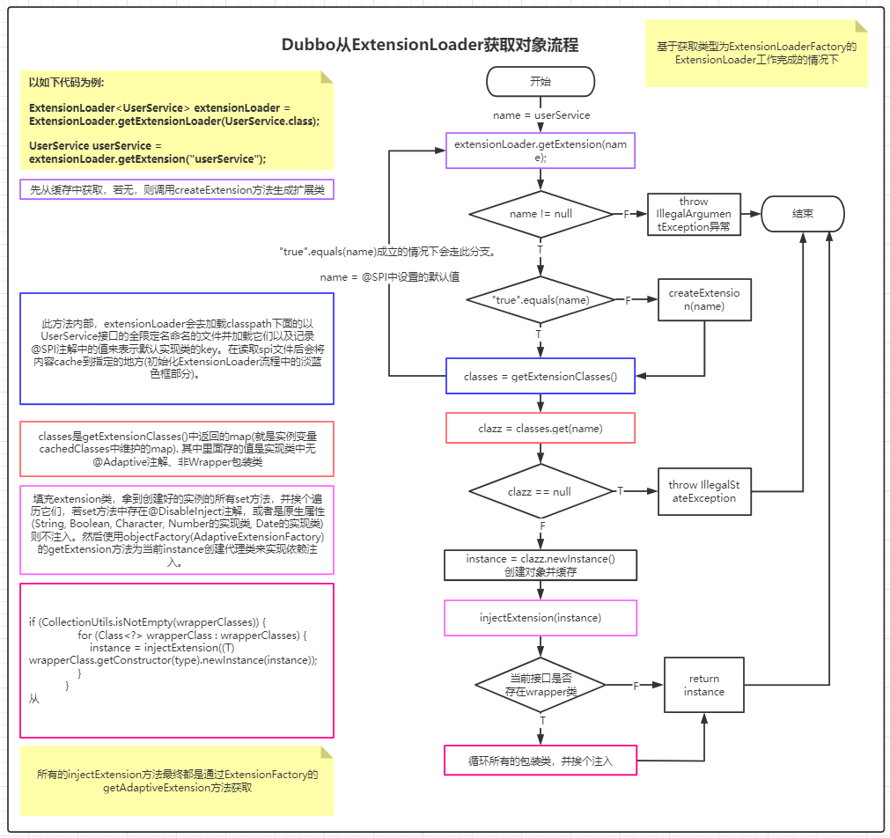

# Dubbo 功能点

## 一、SPI相关功能点

### 1.1 AOP

* aop的实现原理比较简单，都是通过**ExtensionLoader**的**injectionExtension**方法完成的，只需要在spi文件中配置wrapper类即可(**所谓wrapper类就是当前实现类中存在一个带一个参数构造方法，且此构造方法的参数类型就是接口类型**)。具体有如下几个条件:

  ```txt
  1. 接口要添加@SPI注解
  2. spi中配置的实现类中要有wrapper类
  3. 实现类中要有带参构造方法，且参数为接口的类型
  ```

* **注意点:**: 若有多个wrapper类，则会递归的包装，按照spi文件中配置的顺序，**下面**的wrapper包装**上面**的wrapper，即下面的代理上面的

* 写一个例子:

  1. UserService.java类

     ```java
     package com.eugene.sumarry.aop;
     
     import org.apache.dubbo.common.extension.SPI;
     
     @SPI
     public interface UserService {
     
         void findUsers();
     }
     ```

  2. UserServiceImpl.java类

     ```java
     package com.eugene.sumarry.aop;
     
     public class UserServiceImpl implements UserService {
     
         @Override
         public void findUsers() {
             System.out.println("find users");
         }
     }
     ```

  3. UserServiceProxy1.java类

     ```java
     package com.eugene.sumarry.aop;
     
     import org.apache.dubbo.common.extension.Adaptive;
     
     public class UserServiceImplProxy1 implements UserService {
     
         private UserService userService;
     
         public UserServiceImplProxy1(UserService userService) {
             this.userService = userService;
         }
     
         @Override
         public void findUsers() {
             System.out.println("before");
             userService.findUsers();
             System.out.println("after");
         }
     }
     ```

  4. UserServiceProxy2.java类

     ```
     package com.eugene.sumarry.aop;
     
     public class UserServiceImplProxy2 implements UserService {
     
         private UserService userService;
     
         public UserServiceImplProxy2(UserService userService) {
             this.userService = userService;
         }
     
         @Override
         public void findUsers() {
             System.out.println("before");
             userService.findUsers();
             System.out.println("after");
         }
     }
     
     ```

     

  5. **com.eugene.sumarry.aop.UserService**文件

     ```properties
     userService=com.eugene.sumarry.aop.UserServiceImpl
     userServiceProxy1=com.eugene.sumarry.aop.UserServiceImplProxy1
     userServiceProxy2=com.eugene.sumarry.aop.UserServiceImplProxy2
     ```

  6. 通过**ExtensionLoader.getExtensionLoader(UserService.class).getExtension("userService")**获取的UserService对象是被包装了三层的**UserServiceImpl**对象，最外面一层为: **UserServiceImplProxy2**, 其次为**UserServiceImplProxy1**, 最里面为自身**UserServiceImpl**。但要注意，如果我们要单独获取**UserServiceImplProxy1**对象时是获取不到的，因为dubbo只支持从**cachedClasses**属性中去找name，而只有实现类中无@Adaptive注解、无@Active注解、非包装类的情况下，它在spi配置的name才会被加载到**cachedClasses**中 ===> 白话理解就是：普通类才会添加到**cachedClasses**中去

### 1.2 IOC

* ioc的实现比较麻烦，需要依赖`@Adaptive`注解和`URL`参数. 具体规则如下:

  ```txt
  1. 接口中要有@SPI注解
  2. 在spi文件中添加的实现类中，实现类依赖于当前接口类型的属性，且对这个属性有set方法(使用dubbo的SpiExtensionLoader来生成代理类的话，那这个set方法名叫什么都没关系，只要参数类型是接口类型就ok了)
  3. 接口中只要有一个方法存在@Adaptive注解即可完成注入
  4. 被@Adaptive标识的方法中都要有一个叫URL的属性，若没有会抛异常
  ```

* 写一个例子:

  1. IndexService.java类

     ```java
     package com.eugene.sumarry.ioc;
     
     import org.apache.dubbo.common.URL;
     import org.apache.dubbo.common.extension.Adaptive;
     import org.apache.dubbo.common.extension.SPI;
     
     @SPI("test")
     public interface IndexService {
     
         @Adaptive("indexServiceImpl")
         void index(URL url);
     
         @Adaptive("indexServiceImpl")
         void index2(URL url);
     
         void index3(URL url);
     
         void index4();
         
         @Adaptive
         void index5(URL url);
     }
     
     ```

  2. IndexServiceImpl.java类

     ```java
     package com.eugene.sumarry.ioc.impl;
     
     import com.eugene.sumarry.ioc.IndexService;
     import org.apache.dubbo.common.URL;
     
     /**
      可以知道，IndexServiceImpl依赖了一个类型为IndexService的对象，并且为它提供了set方法，
     **/
     public class IndexServiceImpl implements IndexService {
     
         private IndexService indexService;
     
         public void setIndexService(IndexService indexService) {
             this.indexService = indexService;
         }
     
         @Override
         public void index(URL url) {
             System.out.println("IndexServiceImpl index");
             indexService.index(url);
         }
     
         @Override
         public void index2(URL url) {
             System.out.println("IndexServiceImpl index");
             indexService.index2(url);
         }
     
         @Override
         public void index3(URL url) {
             System.out.println("IndexServiceImpl index3");
         }
     
         @Override
         public void index4() {
             System.out.println("IndexServiceImpl index4");
         }
         
         @Override
         public void index5(URL url) {
             System.out.println("IndexServiceImpl index5");
         }
     }
     
     ```

  3. 生成的代理对象IndexServiceImpl$Adaptive

     ```java
     package com.eugene.sumarry.ioc;
     import org.apache.dubbo.common.extension.ExtensionLoader;
     public class IndexService$Adaptive implements com.eugene.sumarry.ioc.IndexService {
         public void index(org.apache.dubbo.common.URL arg0)  {
             if (arg0 == null) throw new IllegalArgumentException("url == null");
             org.apache.dubbo.common.URL url = arg0;
     		// indexServiceImpl和test这两个key是从@SPI注解和@Adaptive注解中获取到的,
             // 最后会从URL中根据key来获取value, 然后再用value去获取extension
             // 这就是为什么在"获取扩展的逻辑"处，特意为URL对象中添加一个key为indexServiceImpl的原因
             String extName = url.getParameter("indexServiceImpl", "test");
             if(extName == null) throw new IllegalStateException("Failed to get extension (com.eugene.sumarry.ioc.IndexService) name from url (" + url.toString() + ") use keys([indexServiceImpl])");
             com.eugene.sumarry.ioc.IndexService extension = (com.eugene.sumarry.ioc.IndexService)ExtensionLoader.getExtensionLoader(com.eugene.sumarry.ioc.IndexService.class).getExtension(extName);
             extension.index(arg0);
         }
         public void index2(org.apache.dubbo.common.URL arg0)  {
             if (arg0 == null) throw new IllegalArgumentException("url == null");
             org.apache.dubbo.common.URL url = arg0;
             String extName = url.getParameter("indexServiceImpl", "test");
             if(extName == null) throw new IllegalStateException("Failed to get extension (com.eugene.sumarry.ioc.IndexService) name from url (" + url.toString() + ") use keys([indexServiceImpl])");
             com.eugene.sumarry.ioc.IndexService extension = (com.eugene.sumarry.ioc.IndexService)ExtensionLoader.getExtensionLoader(com.eugene.sumarry.ioc.IndexService.class).getExtension(extName);
             extension.index2(arg0);
         }
         public void index5(org.apache.dubbo.common.URL arg0)  {
             if (arg0 == null) throw new IllegalArgumentException("url == null");
             org.apache.dubbo.common.URL url = arg0;
             String extName = url.getParameter("index.service", "test");
             if(extName == null) throw new IllegalStateException("Failed to get extension (com.eugene.sumarry.ioc.IndexService) name from url (" + url.toString() + ") use keys([index.service])");
             com.eugene.sumarry.ioc.IndexService extension = (com.eugene.sumarry.ioc.IndexService)ExtensionLoader.getExtensionLoader(com.eugene.sumarry.ioc.IndexService.class).getExtension(extName);
             extension.index5(arg0);
         }
         public void index4()  {
             throw new UnsupportedOperationException("The method public abstract void com.eugene.sumarry.ioc.IndexService.index4() of interface com.eugene.sumarry.ioc.IndexService is not adaptive method!");
         }
     	
     	// 接口中没有@Adaptive注解时，代理类直接抛异常
         public void index3(org.apache.dubbo.common.URL arg0)  {
             throw new UnsupportedOperationException("The method public abstract void com.eugene.sumarry.ioc.IndexService.index3(org.apache.dubbo.common.URL) of interface com.eugene.sumarry.ioc.IndexService is not adaptive method!");
         }
     }
     ```

  4. 获取扩展的逻辑：

     ```java
     URL url = new URL("", "", 1);
     ExtensionLoader<IndexService> indexServiceExtensionLoader = ExtensionLoader.getExtensionLoader(IndexService.class);
     IndexService indexService = indexServiceExtensionLoader.getExtension("indexServiceImpl");
     url = url.addParameter("indexServiceImpl1", "indexServiceImpl1");
     indexService.index(url);
     ```

  5. 由上述可知: 所谓的依赖注入，只是增强了实现类的方法。代理类中并没有维护这个属性。只有被@Adaptive注解修饰的方法内部才会维护这个依赖的属性，当调用index方法时，代理类会根据@SPI注解、方法中@Adaptive注解的值作为key，分别到URL去取value，最后再通过这个value获取extension。进而达到依赖的目的。

  综上所述: dubbo的IOC支持，一个方法依赖一个具体的对象。是方法级别的依赖注入。

  **注意事项:**

  ```txt
  1. 如下类型不能被依赖注入:
  	Byte, Short, Integer, Long, Float, Double, Character, Void, Number的子类，Date的子类
  2. 对于方法内部通过key获取extension中的key的取舍
  	A. 若@SPI注解指定了key，@Adaptive未指定key。则使用@Adaptive默认的key和@SPI指定的key
  	B. 若@SPI注解指定了key，@Adaptive指定key。 则使用他们两
  	C. 若@SPI注解未指定key，@Adaptive指定key。 则使用@Adaptive指定key
  	D. 若@SPI注解未指定key, @Adaptive未指定key，则使用@Adaptive默认的key
  	
  	上述说的默认key解释如下:
  	接口名驼峰之间用.隔开，eg: IndexService, 那么默认key为"index.service"
  3. 在上述的例子中可能不太明白@Adaptive注解到底应该加载哪个接口的方法上。这样看需求了，假设有个OrderService它要依赖UserService。所以在创建好OrderService实例后，需要进行依赖注入。所以要去创建依赖的对象。看过源码的都知道，创建依赖对象是通过AdaptiveExtensionFactory去创建的。若使用的是AdaptiveExtensionFactory中维护的SpiExtensionFactory来创建依赖对象的话，最终会走getAdaptiveExtension()方法。要想创建代理对象(getAdaptiveExtension()方法就是创建代理对象的)，那必须要满足如下条件:
     3.1. spi配置的依赖对象的类型的正常实现类至少一个(所谓正常实现类就是无@Adaptive注解、无@Active注解、非wrapper类)
     3.2. 接口中至少有一个方法存在@Adaptive注解
     3.3. 既然有了@Adaptive注解, 为了使这个方法可用，那就必须要添加URL参数了呀(由上面的代理类可知，若无URL参数，代理类内部的逻辑直接抛异常)。
  
  综上所述： 所以如果OrderService要依赖于UserService的某个方法，所以UserService接口中某个方法必须添加@Adaptive注解并且添加URL参数。
  ```

## 二、Dubbo优先级汇总

|           类别            |                          配置优先级                          | 备注                                                         |
| :-----------------------: | :----------------------------------------------------------: | ------------------------------------------------------------ |
|          XML配置          | 方法级 > 接口级 > 全局配置(**如果级别一样，消费方优先，提供方次之**) | 谁的级别高，则采用谁                                         |
|         属性配置          |        -D(JVM的-D参数) > XML配置 > properties配置文件        | 1：如果在classpath下有超过一个dubbo.properties文件，比如，两个jar包都各自包含了dubbo.properties，dubbo将随机选择一个加载，并且打印错误日志<br>2：如果 `id`没有在`protocol`中配置，将使用`name`作为默认属性。 |
| Dubbo启动加载配置文件顺序 | -D系统参数 > 外部化配置(配置中心) > spring或者通过api的方式配置 > 本地文件dubbo.properties |                                                              |

## 三、Dubbo类扩展器加载过程(官网叫：Dubbo SPI)


### 3.1  加载SPI步骤

* 参考官网：[Dubbo SPI](http://dubbo.apache.org/zh-cn/docs/source_code_guide/dubbo-spi.html)

* 文字总结下流程(**加载spi文件步骤，其中每次需要获取新的ExtensionLoader和第一次创建adaptivExtension时都会对对应的SPI文件进行扫描和解析**)

  > 1、第一步：初始化ExtensionFactory时，会去加载org.apache.dubbo.common.extension.ExtensionFactory的spi文件
  >
  > ```properties
  > adaptive=org.apache.dubbo.common.extension.factory.AdaptiveExtensionFactory
  > spi=org.apache.dubbo.common.extension.factory.SpiExtensionFactory
  > spring=org.apache.dubbo.config.spring.extension.SpringExtensionFactory
  > ```
  >
  > 在解析的过程中，会对每种类型的class做不同的处理(主要参考**org.apache.dubbo.common.extension.ExtensionLoader#loadClass**方法)。
  >
  > `第一：`类中有@Adaptive注解存在，则存到cachedAdaptiveClass变量中，此变量就是一个Class类型的变量，这也就说明，如果一个接口在SPI文件中配置了多个实现类，并且包含@Adaptive注解的实现类的个数超过了1，此时就会报错，源码如下
  >
  > ```java
  > private volatile Class<?> cachedAdaptiveClass = null;
  > 
  > // ......
  > 
  > if (clazz.isAnnotationPresent(Adaptive.class)) {
  >  if (cachedAdaptiveClass == null) {
  >      cachedAdaptiveClass = clazz;
  >  } else if (!cachedAdaptiveClass.equals(clazz)) {
  >      throw new IllegalStateException("More than 1 adaptive class found: "
  >                                         + cachedAdaptiveClass.getClass().getName()
  >                                         + ", " + clazz.getClass().getName());
  >     }
  > }
  > ```
  >
  > `第二：`是否为包装类，如果是包装类，则将类信息保存在叫**cachedWrapperClasses**的set集合中，源码如下：
  >
  > ```java
  > if (isWrapperClass(clazz)) {
  >     Set<Class<?>> wrappers = cachedWrapperClasses;
  >     if (wrappers == null) {
  >         cachedWrapperClasses = new ConcurrentHashSet<Class<?>>();
  >         wrappers = cachedWrapperClasses;
  >     }
  >     wrappers.add(clazz);
  > }
  > 
  > /* 
  > 其中isWrapperClass的逻辑大致为：
  > 判断该Class中带一个参数的构造方法，且形参是否为自己实现的接口类型。
  > */
  > ```
  >
  > 第三：spi中配置的实现类是一个被@Activate注解修饰的类，会被缓存到cachedActivates的map中去，源码如下：
  >
  > ```java
  > private void cacheActivateClass(Class<?> clazz, String name) {
  >     Activate activate = clazz.getAnnotation(Activate.class);
  >     if (activate != null) {
  >         cachedActivates.put(name, activate);
  >     } else {
  >         // support com.alibaba.dubbo.common.extension.Activate
  >         com.alibaba.dubbo.common.extension.Activate oldActivate = clazz.getAnnotation(com.alibaba.dubbo.common.extension.Activate.class);
  >         if (oldActivate != null) {
  >             cachedActivates.put(name, oldActivate);
  >         }
  >     }
  > }
  > ```
  >
  > 第四：将当前spi中配置的名称缓存到当前ExtensionLoader对应的cachedNames中，其中cachedNames是一个juc下面的map，key为当前spi文件中配置的value(会转换成Class对象)，value为spi中配置的名称, 与cachedClasses属性缓存的相反，cachedClasses内部的data是一个map，其中key为spi中配置的名称，value为spi中配置的value。源码如下：
  >
  > ```java
  > private void cacheName(Class<?> clazz, String name) {
  >     if (!cachedNames.containsKey(clazz)) {
  >         cachedNames.put(clazz, name);
  >     }
  > }
  > ```
  >
  > 第五：将解析spi出来的类全部存到传入的extensionClasses参数中，最终会存到当前ExtensionLoader的cachedClasses属性中。源码如下：
  >
  > ```java
  > private void saveInExtensionClass(Map<String, Class<?>> extensionClasses, Class<?> clazz, String name) {
  >     Class<?> c = extensionClasses.get(name);
  >     if (c == null) {
  >         extensionClasses.put(name, clazz);
  >     } else if (c != clazz) {
  >         throw new IllegalStateException("Duplicate extension " + type.getName() + " name " + name + " on " + c.getName() + " and " + clazz.getName());
  >     }
  > }
  > ```
  >
  > 上述五步还只是将Type为ExtensionFactory的ExtensionLoader已经加载完毕了，当把Type为ExtensionFactory的ExtensionLoader加载完毕后才是真正开始加载Type为UserService的ExtensionLoader了。加载Type为UserService的ExtensionLoader步骤也是一摸一样，唯一不同的就是在构建objectFactory属性时，默认情况下会将**AdaptiveExtensionFactory**类给填充进去，而type为ExtensionFactory的objectFactory属性为null。
  >

## 四、getExtension api获取实例过程

* 此步骤会涉及到上文第一章提到的AOP和IOC，其中IOC功能在官网给的专业术语为：**自适应扩展机制**

* 整个获取实例源码如下：

  ```java
      public T getExtension(String name) {
          if (StringUtils.isEmpty(name)) {
              throw new IllegalArgumentException("Extension name == null");
          }
          if ("true".equals(name)) {
              return getDefaultExtension();
          }
          final Holder<Object> holder = getOrCreateHolder(name);
          Object instance = holder.get();
          if (instance == null) {
              synchronized (holder) {
                  instance = holder.get();
                  if (instance == null) {
                      instance = createExtension(name);
                      holder.set(instance);
                  }
              }
          }
          return (T) instance;
      }
  ```

  

* 整个获取实例过程可由下图总结：

  

### 4.1  依赖注入(IOC)过程

* 源码如下：

  ```java
  private T injectExtension(T instance) {
      try {
          if (objectFactory != null) {
              for (Method method : instance.getClass().getMethods()) {
                  // 检测方法是否以 set 开头，且方法仅有一个参数，且方法访问级别为 public
                  if (isSetter(method)) {
                      if (method.getAnnotation(DisableInject.class) != null) {
                          continue;
                      }
                      Class<?> pt = method.getParameterTypes()[0];
                      if (ReflectUtils.isPrimitives(pt)) {
                          continue;
                      }
                      try {
                          // 获取方法后面的签名，eg: 方法名为：setVersion, 调用此方法后，将返回version
                          String property = getSetterProperty(method);
                          /**
                          * 注入进去的对象主要由如下代码决定，其中objectFactory的属性为adaptiveExtensionFactory
                          * 其中内部维护了两个ExtensionFactory，分别为：
                          * @see SpiExtensionFactory  -> 普通情况下，使用的是此ExtensionFactory，且调用getExtesion方法时，返回的是一个adaptiveExtension，此种情况下，属性名没什么作用
                          * @see org.apache.dubbo.config.spring.extension.SpringExtensionFactory  -> 用于从 Spring 的 IOC 容器中获取所需的拓展
                          */
                          Object object = objectFactory.getExtension(pt, property);
                          if (object != null) {
                              method.invoke(instance, object);
                          }
                      } catch (Exception e) {
                          logger.error("Failed to inject via method " + method.getName()
                                       + " of interface " + type.getName() + ": " + e.getMessage(), e);
                      }
                  }
              }
          }
      } catch (Exception e) {
          logger.error(e.getMessage(), e);
      }
      return instance;
  }
  ```

  由上述的总结可知，objectFactory属性的值就是**AdaptiveExtensionFactory**。整个依赖注入的过程比较简单：

  > 第一：判断当前扩展类是否符合注入条件，遍历所有方法，并根据如下条件挨个判断
  >
  > | **set开头的方法**                 |
  > | --------------------------------- |
  > | **方法中无DisableInject注解标识** |
  > | **方法非private修饰**             |
  >
  > 第二：上述三个条件同时满足时才会进行依赖注入，大致的流程就是使用反射调用set方法，但是调用前需要获取到填充到set方法的参数，而这个参数就是通过**objectFactory.getExtension(pt, property);**获取，其中objectFactory为**AdaptiveExtensionFactory**，它内部维护了两个ExtensionFactory，一个为SpiExtensionFactory另外一个是SpringExtensionFactory，两者都是获取Extension的工厂，具体细节如下表所示：
  >
  > |  ExtensionFactory类别  |                             作用                             |                             备注                             |
  > | :--------------------: | :----------------------------------------------------------: | :----------------------------------------------------------: |
  > |  SpiExtensionFactory   | 根据传入的class，调用ExtensionLoadet.getExtension api来获取对象 | 内部获取的是对应Type的AdaptiveExtension类。要获取AdaptiveExtension类有两种渠道：<br>1、自己实现。自己在实现类中指定某个类为AdaptiveExtension(添加@Adaptive注解）<br>2、使用dubbo框架动态生成，接口中存在@Adaptive修饰的方法且方法参数为**org.apache.dubbo.common.URL** |
  > | SpringExtensionFactory |        根据传入的class和name，从spring容器中获取bean         |                      从spring中获取bean                      |
  >
  > 总结：依赖注入的过程如果失败了，并不会影响整个过程，仅仅对应属性的值为null而已。

### 4.2 构建Wrapper类过程(AOP)

* 源码如下：

  ```java
  private T createExtension(String name) {
  	// 省略部分代码.....
      try {
          // 省略部分代码.....
  		
          Set<Class<?>> wrapperClasses = cachedWrapperClasses;
          // 获取所有的wrapper类，并挨个调用他们的构造方法，并挨个进行依赖注入
          if (CollectionUtils.isNotEmpty(wrapperClasses)) {
              for (Class<?> wrapperClass : wrapperClasses) {
                  instance = injectExtension((T) wrapperClass.getConstructor(type).newInstance(instance));
              }
          }
          return instance;
      } catch (Throwable t) {
          throw new IllegalStateException("Extension instance (name: " + name + ", class: " +
                                          type + ") couldn't be instantiated: " + t.getMessage(), t);
      }
  }
  ```

* 总结如下：

  > 整个过程还是比较简单的，如果对Wrapper类的概念比较清楚的话，这个步骤还是很简单的，总共两个步骤：
  >
  > 1、调用有参构造方法创建Wrapper类
  >
  > 2、对创建出来的Wrapper类进行依赖注入

## 五、服务导出流程

* 如官网所说：[服务导出流程](http://dubbo.apache.org/zh-cn/docs/source_code_guide/export-service.html)。服务导出一共分为两个部分

  > 1、Dubbo服务导出流程始于Spring发布refresh事件
  >
  > 2、执行服务导出流程

* 服务导出流程分为三个部分

  > 1、前置工作：用于检查参数、组装URL
  >
  > 2、导出服务：包含导出服务到本地(JVM)和导出服务到远程两个步骤
  >
  > 3、注册至注册中心：向注册中心注册服务，用于服务发现

### 5.1 以官网Demo dubbo-demo-xml 模块为例解析服务导出流程

#### 5.1.1 Dubbo服务导出集成Spring的第一个扩展点`NamespaceHandlerSupport`

* 以xml的格式来启动spring上下文，其中我们可以在xml中写如下类似的标签：

  ```xml
  <dubbo:service id="test" interface="org.apache.dubbo.demo.DemoService" ref="demoService"/>
  ```

  这种标签，最终会被spring给解析出来，会对应**ServiceBean**类。这样的结果是有地方配置的，详看**org.apache.dubbo.config.spring.schema.DubboNamespaceHandler**类。其中主要看它的`init`方法，如下：

  ```java
  @Override
  public void init() {
      registerBeanDefinitionParser("application", new DubboBeanDefinitionParser(ApplicationConfig.class, true));
      registerBeanDefinitionParser("module", new DubboBeanDefinitionParser(ModuleConfig.class, true));
      registerBeanDefinitionParser("registry", new DubboBeanDefinitionParser(RegistryConfig.class, true));
      registerBeanDefinitionParser("config-center", new DubboBeanDefinitionParser(ConfigCenterBean.class, true));
      registerBeanDefinitionParser("metadata-report", new DubboBeanDefinitionParser(MetadataReportConfig.class, true));
      registerBeanDefinitionParser("monitor", new DubboBeanDefinitionParser(MonitorConfig.class, true));
      registerBeanDefinitionParser("metrics", new DubboBeanDefinitionParser(MetricsConfig.class, true));
      registerBeanDefinitionParser("provider", new DubboBeanDefinitionParser(ProviderConfig.class, true));
      registerBeanDefinitionParser("consumer", new DubboBeanDefinitionParser(ConsumerConfig.class, true));
      registerBeanDefinitionParser("protocol", new DubboBeanDefinitionParser(ProtocolConfig.class, true));
      // 一个dubbo:service标签 就对应一个ServiceBean对象，spring容器会去初始化它
      registerBeanDefinitionParser("service", new DubboBeanDefinitionParser(ServiceBean.class, true));
      registerBeanDefinitionParser("reference", new DubboBeanDefinitionParser(ReferenceBean.class, false));
      registerBeanDefinitionParser("annotation", new AnnotationBeanDefinitionParser());
  }
  ```

  在init方法中，当我们配置**<dubbo:service />**类似的标签时，spring会创建一个类型为**ServiceBean**的bean到spring容器(每一个dubbo:service标签对应一个ServiceBean类型的bean)。有了这个依据，我们可以把方向定位到**ServiceBean**类上了(PS：除开ServiceBean之外，还有ReferenceBean也利用了spring的一些扩展点，当分析到ReferenceBean再详细总结)。

#### 5.1.2 Dubbo服务导出集成Spring的第二个扩展点BeanPostProcessor

* 先赞叹下Spring的BeanPostProcessor扩展点，它真的太牛逼了。可以对bean做**任何处理**，包括**代理**、**自定义填充属性**等等。其中如果这个bean是实现了不同Aware接口，都会进行回调。其中对于处理aware的入口为**ApplicationContextAwareProcessor**类，在此类的**postProcessBeforeInitialization**方法中会对各种aware做处理。换言之就是：我们可以通过**ApplicationContextAwareProcessor**类来获取spring上下文的许多东西，源码如下：

  ```java
  if (bean instanceof Aware) {
      if (bean instanceof EnvironmentAware) {
          ((EnvironmentAware) bean).setEnvironment(this.applicationContext.getEnvironment());
      }
      if (bean instanceof EmbeddedValueResolverAware) {
          ((EmbeddedValueResolverAware) bean).setEmbeddedValueResolver(this.embeddedValueResolver);
      }
      if (bean instanceof ResourceLoaderAware) {
          ((ResourceLoaderAware) bean).setResourceLoader(this.applicationContext);
      }
      if (bean instanceof ApplicationEventPublisherAware) {
          ((ApplicationEventPublisherAware) bean).setApplicationEventPublisher(this.applicationContext);
      }
      if (bean instanceof MessageSourceAware) {
          ((MessageSourceAware) bean).setMessageSource(this.applicationContext);
      }
      if (bean instanceof ApplicationContextAware) {
          ((ApplicationContextAware) bean).setApplicationContext(this.applicationContext);
      }
  }
  ```

* 此扩展点的作用比较简单，就是为bean填充内部需要的相关aware接口。那**ServiceBean**来举例，ServiceBean主要实现了ApplicationContextAware和ApplicationEventPublisherAware接口，因此只是为了填充内部的**ApplicationEventPublisher**和**ApplicationContext**属性，仅此而已。

#### 5.1.3 Dubbo服务导出集成Spring的第三个扩展点InitializingBean

* 此扩展点在dubbo中就比较重要了，它是利用此扩展点来填充内部的一些配置属性的，比如我们在xml中配置的如下标签

  ```xml
  <dubbo:application name="demo-provider"/>
  <dubbo:registry address="multicast://224.5.6.7:1234" />
  <dubbo:protocol name="dubbo"/>
  ```

  最终都会通过此后置处理器将ServiceBean(拿ServiceBean举例)内部的一些**protocols、application、module、registries**等配置属性给填充。当然前提还是得配置好且被spring解析到。在Dubbo这些配置类中，都会存在一个叫ConfigManager的类中，此类为单例(**懒汉式**)，内部存放了当前dubbo应用程序的所有配置，其中包括共用的配置和每个服务私有的配置。

#### 5.1.4 Dubbo服务导出集成Spring的第四个扩展点ApplicationListener<ContextRefreshedEvent>

* 在ServiceBean中，它还实现了ApplicationListener<ContextRefreshedEvent>接口。这代表着这个类对spring的ContextRefreshedEvent事件感兴趣(详见org.springframework.context.support.AbstractApplicationContext#publishEvent(org.springframework.context.ApplicationEvent)方法，当spring容器初始化后，会发布ContextRefreshedEvent事件，此时就会通知所有订阅了此事件的监听者)。同时，在Dubbo服务暴露的开发者文档中也有提到，Dubbo服务暴露的核心就是Spring容器的刷新事件，如下为Dubbo官网的原话，[点此链接查看](http://dubbo.apache.org/zh-cn/docs/source_code_guide/export-service.html)：

  ```txt
  Dubbo 服务导出过程始于 Spring 容器发布刷新事件，Dubbo 在接收到事件后，会立即执行服务导出逻辑
  ```

* 官网中有说到，Dubbo的服务导出逻辑大致分为三个大部分：

  ```txt
  1、第一部分是前置工作，主要用于检查参数，组装 URL
  2、第二部分是导出服务，包含导出服务到本地 (JVM)，和导出服务到远程两个过程
  3、第三部分是向注册中心注册服务，用于服务发现
  ```

##### 5.1.4.1 前置条件

* 这里引用下官网的原话：

  > 前置工作主要包含两个部分，分别是配置检查和URL装配。在服务导出之前，Dubbo需要检查用户的配置是否合理，或者为用户补充缺省配置。配置检查完成后需要根据这些配置组装URL。在Dubbo中，URL的作用十分重要。Dubbo使用URL作为配置载体，所有的扩展点都是通过URL获取配置。

###### 前置条件的第一步：检查配置

* 第一个判断比较简单，服务导出的第一层条件为：**当前条件不处于导出状态**。直接看源码：

  ```java
  // org.apache.dubbo.config.spring.ServiceBean#onApplicationEvent
  @Override
  public void onApplicationEvent(ContextRefreshedEvent event) {
      // 判断是否满足导出服务条件  => 服务未导出
      if (!isExported() && !isUnexported()) {
          if (logger.isInfoEnabled()) {
              logger.info("The service ready on spring started. service: " + getInterface());
          }
          // 服务导出过程使用了责任链模式，一层一层的调用父类相同的方法，由每一个类专心处理自己的事
          export();
      }
  }
  ```

  第一个条件验证通过后，直接调用export方法。

* org.apache.dubbo.config.spring.ServiceBean#export源码

  ```java
  @Override
  public void export() {
      // 调用父类的export方法， 处于服务导出中三个阶段的第一个阶段：检查参数和组装URL
      /**
      * 检查参数
      * @see ServiceConfig#checkAndUpdateSubConfigs()
      * 组装URL
      * @see ServiceConfig#doExport()
      */
      super.export();
      // Publish ServiceBeanExportedEvent
      publishExportEvent();
  }
  ```

  此步骤为上述验证前置条件的入口，开始执行官网所说的两个步骤：**检查参数**和**组装URL**。在做这两件事的时候，使用了一种叫责任链的设计模式，通过调用抽象的方法，一层一层的往上调用，由父类来做一些前置条件。比如在此方法中，做前置条件的一些逻辑全部在父类(**ServiceConfig**)中处理了。

###### 检查配置的第一步：**Dubbo需要检查用户的配置是否合理，或者为用户补充缺省配置**

* 主要分为如下几个小步骤执行

  > 1. 检测 <dubbo:service> 标签的 interface 属性合法性，不合法则抛出异常
  > 2. 检测 ProviderConfig、ApplicationConfig 等核心配置类对象是否为空，若为空，则尝试从其他配置类对象中获取相应的实例。
  > 3. 检测并处理泛化服务和普通服务类
  > 4. 检测本地存根配置，并进行相应的处理
  > 5. 对 ApplicationConfig、RegistryConfig 等配置类进行检测，为空则尝试创建，若无法创建则抛出异常

###### 检查配置第二步：Dubbo根据上述的配置组装URL  -->  多协议

* Dubbo 允许我们使用不同的协议导出服务，也允许我们向多个注册中心注册服务。源码如下：

  ```java
  private void doExportUrls() {
      List<URL> registryURLs = loadRegistries(true);
      for (ProtocolConfig protocolConfig : protocols) {
          String pathKey = URL.buildKey(getContextPath(protocolConfig).map(p -> p + "/" + path).orElse(path), group, version);
          ProviderModel providerModel = new ProviderModel(pathKey, ref, interfaceClass);
          ApplicationModel.initProviderModel(pathKey, providerModel);
          doExportUrlsFor1Protocol(protocolConfig, registryURLs);
      }
  }
  ```

  其中loadRegistries方法主要包含如下逻辑：

  ```txt
  1、检测是否存在注册中心配置类，不存在则抛出异常
  2、构建参数映射集合，也就是 map
  3、构建注册中心链接列表
  4、遍历链接列表，并根据条件决定是否将其添加到 registryList 中
  ```

  


