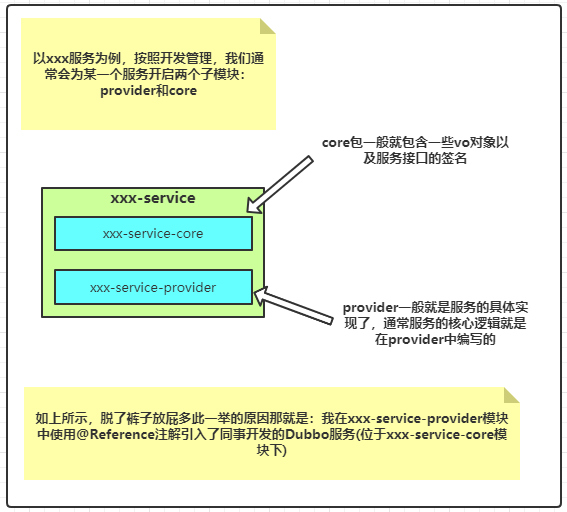
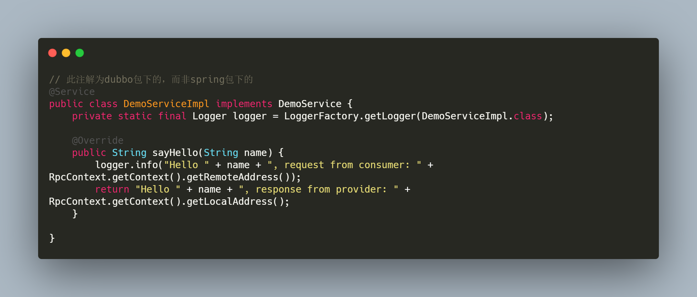
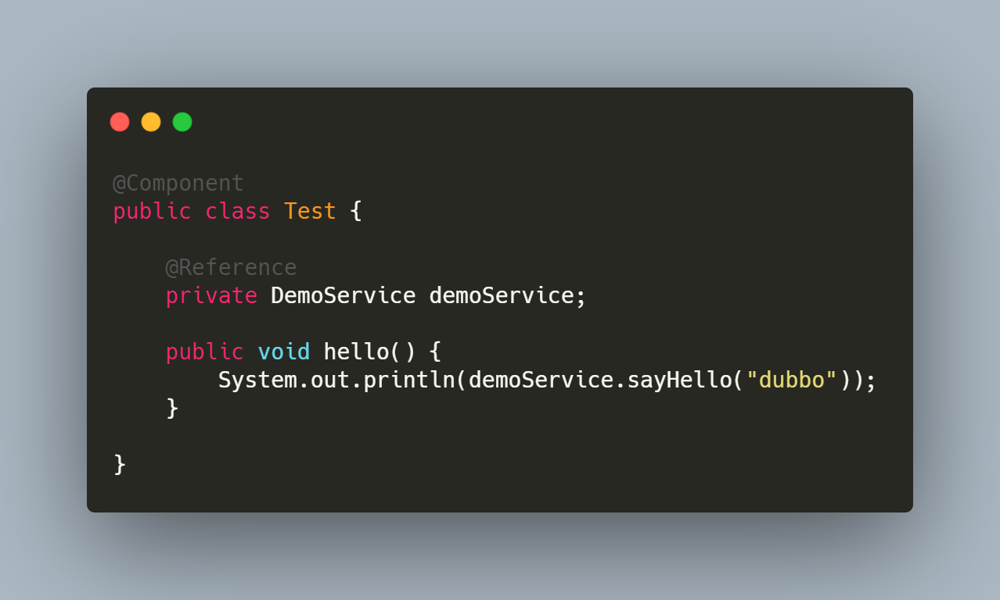
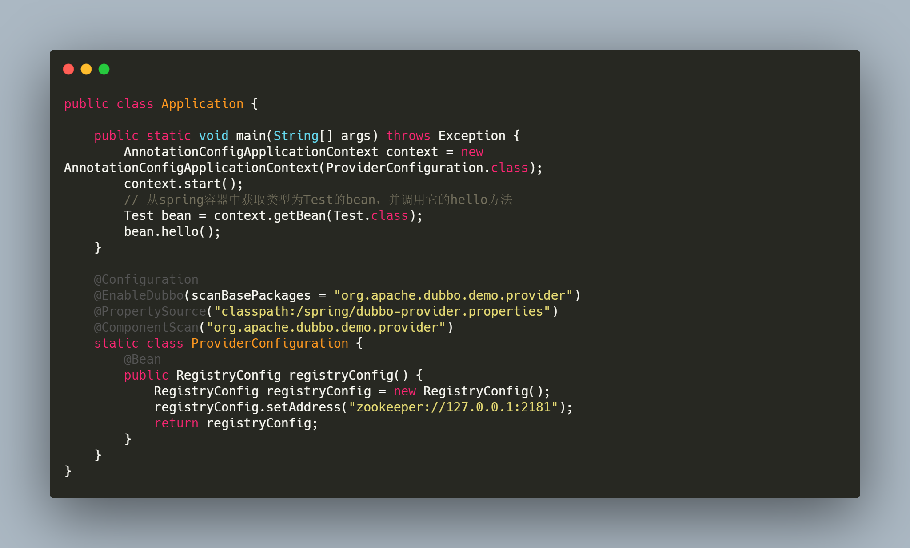
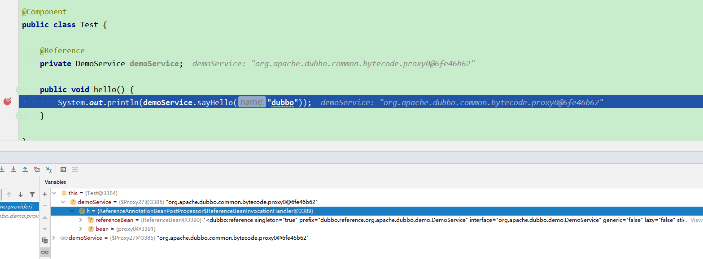
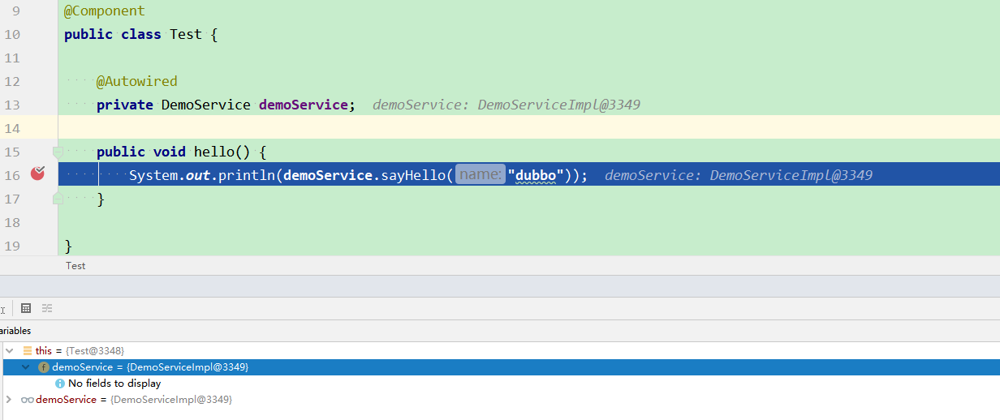
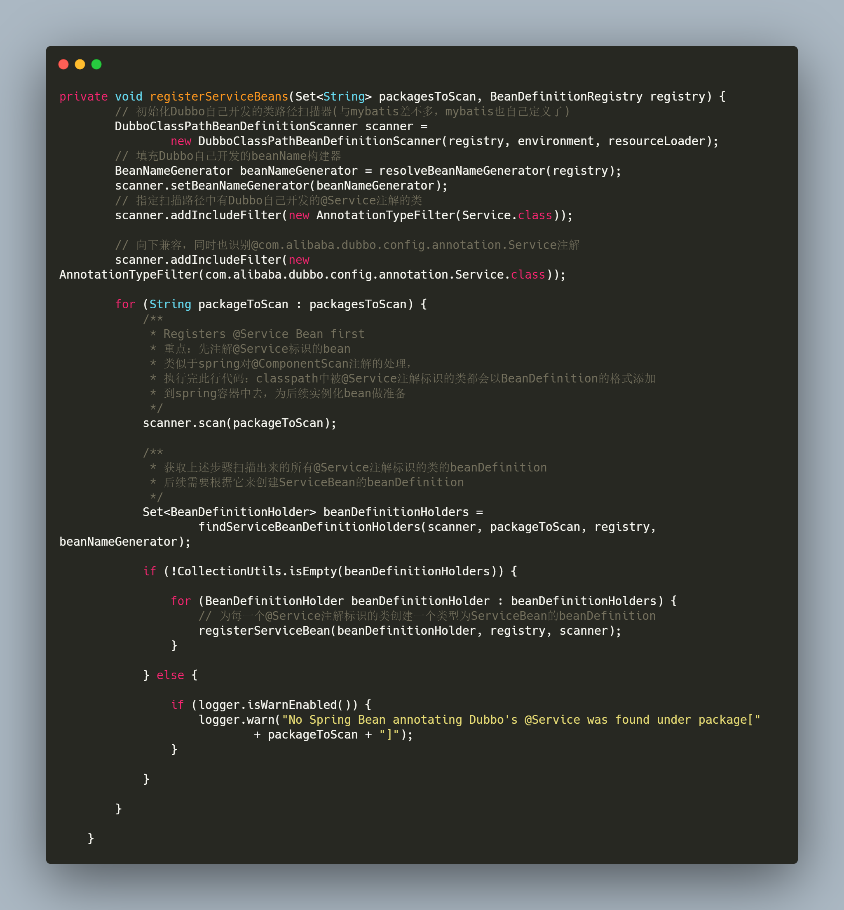

## 我在Dubbo的服务提供者中使用@Reference注解引入自己，结果被项目组通报批评了。

## 背景

* 最近，项目正在紧急迭代的过程中，由于我们内部的一个系统A任务量比较大，因此，组内的大多数人都来帮忙开发了。而我，也不例外，
  一起去帮忙了。在我负责模块中，有一段逻辑是依赖于其他同事开发的接口，因此我就写了个Todo进行标识。在他告知我接口开发完成并且它是一个Dubbo服务接口后，我很熟练的将todo移除，并将代码进行了同步，同时使用了@Reference接口把服务引入了进来。在进行单元测试的过程中，我本着好奇的心态，想学习下同事写的代码内涵时，我发现了一个奇怪的问题：我居然在**同一个项目(服务提供者)**中使用`@Reference注解自己引入了自己`。当时，
  我心态直接崩了，这就相当于脱了裤子放屁，多此一举了！

## 一、什么叫自己引入自己？

* 自己引入自己是什么含义呢？我们参考如下图示

  

  如果经常使用Dubbo进行开发的同学应该就能明白，也就是说，我们的消费端不需要知道**服务提供者**内部实现的任何逻辑，只需要保证方法的签名一模一样，就能**凭空**生成一个类型一样且具备RPC调用功能的spring bean。

* 那我们再来说说为什么需要远程调用？这很简单，因为这个方法的功能不在当前项目中呀，我们需要远程调用其他项目提供这个功能的api来实现具体的功能。那么问题来了，这里有个前提：**这个方法的功能不在当前项目中**。读到这里的你，是否能明白**脱了裤子放屁**那句话了呢？

## 二、抛出问题

* ok，综上所述。我们已经可以断定，在**xxx-service-provider**中使用@Reference注解引用服务是错误的，这会增加一层网络调用的消耗，浪费网络资源。那么问题来了，我们要如何解决这个问题呢？

## 三、以一个demo还原上述场景

* 由于上述背景的存在，我们以Dubbo源码工程的**dubbo-demo-annotation-provider**模块来做演示。
* 该模块非常简单，就暴露出来了一个服务，不过我为了演示出效果，做了一些修改，具体如下：

### 3.1 Dubbo @Service注解暴露出DemoServiceImpl服务

### 3.2  自定义一个叫Test的bean，内部引入DemoServiceImpl服务

### 3.3 启动应用程序

### 3.4  运行结果

这个运行结果应该是很容易想象到的，肯定是能执行成功。我们在Test的hello方法中添加一个端点，来查看DemoService对象的真实面貌

### 3.5 Debugger查看@Reference注解引入的对象

从debugger来看，我们很确定它是一个**代理对象**，虽然我们看不到它内部的类(**感兴趣的可以使用arthas工具来看**)，但我们依然可以确定它就是一个具备RPC调用功能的spring bean(**为什么是个spring bean？大家可以想一下**)。但我们之前说了，我们在服务提供者中自己引入自己是多此一举的！那要如何解决这个问题呢？在这，我就直接把答案列出来了：我们可以直接使用@Autowired注解依赖注入进去。

### 3.6 使用@Autowired注解解决自己依赖自己的情况

同样的，添加一个端点进行debug查看：

此时你会发现，注入进来的对象不再是代理对象了

### 3.7 Dubbo开发的@Service 注解的功能点(结论)

* 通过如上案例的测试，我们可以断定：Dubbo开发的`@Service`注解会做两件事：

  > **第一：会进行服务导出，在spring容器中会对应一个ServiceBean**
  >
  > **第二：会对服务暴露的类进行spring bean的初始化**

  **也就是说：Dubbo开发的@Service注解包含了Spring开发的@Service注解功能**

### 3.8 从源码的角度证明Dubbo @Service注解的功能点

* 首先是证明上述的第一点：**会进行服务导出，在spring容器中会对应一个ServiceBean**，这个在我的[Dubbo2.7.3版本源码学习系列六: Dubbo服务导出源码解析](https://blog.csdn.net/avengerEug/article/details/109438274)文章中有描述过，这里就不过多阐述。

* 证明第二点：**会对服务暴露的类进行spring bean的初始化**。要证明这一点，可能需要一点spring的功底，在这里就不带着大家一点一点的找了。通过我自己的摸索与定位，最终定位于如下方法：

  **org.apache.dubbo.config.spring.beans.factory.annotation.ServiceAnnotationBeanPostProcessor#registerServiceBeans**，

  其源码为：

  

  这里要注意下：在注册ServiceBean时，因为每一个暴露出来的服务对应一个ServiceBean，因为ServiceBean的名称比较规范，针对于DemoServiceImpl服务的暴露，会在spring中创建一个名字叫**ServiceBean:org.apache.dubbo.demo.DemoService**  ==> 代表着这个ServiceBean对应的服务是DemoService。

  这一个步骤的主要作用就是注册BeanDefinition，具体的实例化过程则可以参考我的spring相关系列的文章了，这里就不过多阐述了。

## 四、总结

* 在平时开发时，我们一定要与团队的小伙伴**多沟通！多沟通！多沟通！**重要的话说三遍。同时，咱们在编写代码是多加一点思考，为自己写的每一行代码负责人。争取不要出现**自己引用自己**的情况。
* **如果你觉得我的文章有用的话，欢迎点赞和关注。:laughing:**

* **I'm a slow walker, but I never walk backwards**

