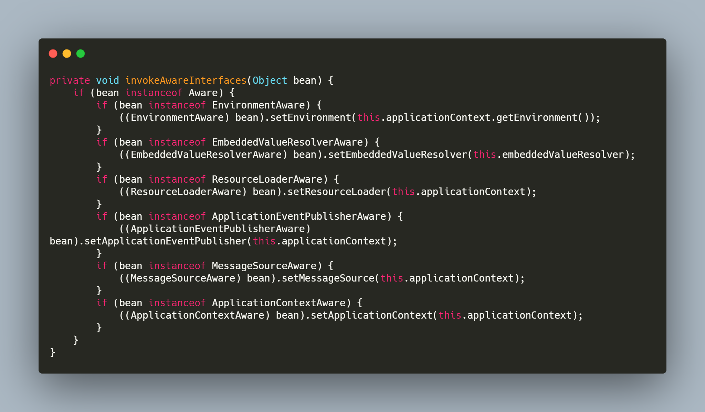

## 前言

* [上篇文章: Dubbo2.7.3版本源码学习系列五: 学习Dubbo服务导出源码前置知识点(ProxyFactory和Wrapper类)](https://blog.csdn.net/avengerEug/article/details/109340657)，咱们了解了Dubbo的ProxyFactory和Wrapper类的作用。本篇文章，咱们开始进入Dubbo服务导出的源码解读，在这个环节，咱们会用到上篇文章所总结到的知识点。

## 一、官网对服务导出的简介

> Dubbo 服务导出过程始于 Spring 容器发布刷新事件，Dubbo 在接收到事件后，会立即执行服务导出逻辑。整个逻辑大致可分为三个部分，第一部分是前置工作，主要用于检查参数，组装 URL。第二部分是导出服务，包含导出服务到本地 (JVM)，和导出服务到远程两个过程。第三部分是向注册中心注册服务，用于服务发现。

* 通过官网的描述，咱们可以知道服务导出的源码开始于Spring的刷新事件(这里对Spring容器刷新事件不太了解的，可以参考此篇文章[spring 5.0.x源码学习系列十: 观察者设计模式与Spring 事件驱动模型](https://blog.csdn.net/avengerEug/article/details/104250613))。Dubbo在进行服务导出时，会做三个步骤：

  > 1、前置工作：主要用于检查参数、组装URL  <=====>  **类似于Spring在初始化bean时定义的一系列BeanDefinition**
  >
  > 2、导出服务：包括服务导出到本地和导出到远程 
  >
  > 3、服务注册：向注册中心注册当前被导出的服务  

## 二、前置工作：检查参数、组装URL

* 在Dubbo做**前置工作(检查参数、组装URL)**之前，Dubbo得先把当前服务对应的一些配置从配置文件或Spring 配置类中解析出来，其次才是执行所谓的前置工作。在这一个个过程中，用到了spring的许多过程点，在这里，我将用到的spring扩展点及其作用都一一罗列出来。

### 2.1 Dubbo服务导出集成Spring的第一个扩展点`NamespaceHandlerSupport`(针对xml而言)

* 我们都知道，使用Dubbo来集成spring时，官方提供给我们两种方式：

  > 第一：基于注解
  >
  > 第二：基于XML

  基于注解的解析，在之前的[Dubbo2.7.3版本源码学习系列三: Dubbo注解版本加载配置原理](https://blog.csdn.net/avengerEug/article/details/105338579)文章中有总结到。这里就不过多解释了。

  基于XML的解析，这里简单说明下：

  > * 以xml的格式来启动spring上下文，其中我们可以在xml中写如下类似的标签：
  >
  >   ```java
  >   <dubbo:service id="test" interface="org.apache.dubbo.demo.DemoService" ref="demoService"/>
  >   ```
  >
  >   这种标签，最终会被spring给解析出来，会对应**ServiceBean**类。这样的结果是有地方配置的，详看**org.apache.dubbo.config.spring.schema.DubboNamespaceHandler**类。其中主要看它的`init`方法，如下：
  >
  >   
  >
  >   在init方法中，当我们配置**<dubbo:service />**类似的标签时，spring会解析我们的配置并为对应的类型创建BeanDefinition。(**每一个dubbo:service标签对应一个ServiceBean类型的BeanDefinition**)。

* 因此，通过第一个扩展点后，我们在xml配置的信息已经变成Spring的BeanDefinition了，为spring构建bean创建的条件。

### 2.2 Dubbo服务导出集成Spring的第二个扩展点BeanPostProcessor

* 先赞叹下Spring的BeanPostProcessor扩展点，它真的太牛逼了。可以对bean做**任何处理**，包括**代理**、**自定义填充属性**等等。其中如果这个bean是实现了不同Aware接口，都会进行回调。其中对于处理aware的入口为**ApplicationContextAwareProcessor**类，在此类的**postProcessBeforeInitialization**方法中会对各种aware做处理。换言之就是：我们可以通过**ApplicationContextAwareProcessor**类来获取spring上下文的许多东西，源码如下：

  

* 此扩展点的作用比较简单，就是为bean填充内部需要的相关aware接口。那**ServiceBean**来举例，ServiceBean主要实现了ApplicationContextAware和ApplicationEventPublisherAware接口，因此只是为了填充内部的**ApplicationEventPublisher**和**ApplicationContext**属性，仅此而已。

### 2.3 Dubbo服务导出集成Spring的第三个扩展点InitializingBean

* 此扩展点在dubbo中就比较重要了，它是利用此扩展点来填充额外的一些配置，比如我们在xml中配置的如下标签

  ```xml
  <dubbo:application name="demo-provider"/>
  <dubbo:registry address="zookeeper://127.0.0.1:2181" />
  <dubbo:protocol name="dubbo"/>
  ```

  最终都会通过此后置处理器将ServiceBean(拿ServiceBean举例)内部的一些**protocols、application、module、registries**等配置属性给填充，相当于把当前服务与其他共享的配置给关联起来，进而知道当前服务属于哪个应用程序、共用哪些协议。当然前提还是得配置好且被spring解析到。在Dubbo这些配置类中，都会存在一个叫ConfigManager的类中，此类为单例(**懒汉式**)，内部存放了当前dubbo应用程序的所有配置，其中包括共用的配置和每个服务私有的配置。

* 因此，通过Spring的InitializingBean扩展点，我们可以将当前暴露的服务与其他配置相关联，比如当前暴露出去的服务支持哪些协议、使用哪个注册中心、属于哪个应用程序。

### 2.4 Dubbo服务导出集成Spring的第四个扩展点ApplicationListener<ContextRefreshedEvent>

* 在ServiceBean中，它还实现了ApplicationListener<ContextRefreshedEvent>接口。这代表着这个类对spring的ContextRefreshedEvent事件感兴趣(详见org.springframework.context.support.AbstractApplicationContext#publishEvent(org.springframework.context.ApplicationEvent)方法，当spring容器初始化后，会发布ContextRefreshedEvent事件，此时就会通知所有订阅了此事件的监听者)。同时，在Dubbo服务暴露的开发者文档中也有提到，Dubbo服务暴露的核心就是Spring容器的刷新事件，如下为Dubbo官网的原话，[点此链接查看](http://dubbo.apache.org/zh-cn/docs/source_code_guide/export-service.html)：

  > ```txt
  > Dubbo 服务导出过程始于 Spring 容器发布刷新事件，Dubbo 在接收到事件后，会立即执行服务导出逻辑
  > ```

  因此，上述三个扩展点都是为Dubbo服务导出奠定了基础，服务导出的第一步不是要检查参数么？要检查，首先得把咱们配置的信息给解析出来嘛，不然检查什么呢？

### 2.5  从Spring的事件驱动模型扩展点开始，正式进入Dubbo的服务导出逻辑

* 根据我们最开始的总结，服务导出分为如下三步：

  ```txt
  1、前置工作：主要用于检查参数、组装URL  <=====>  **类似于Spring在初始化bean时定义的一系列BeanDefinition**
  2、导出服务：包括服务导出到本地和导出到远程 
  3、服务注册：向注册中心注册当前被导出的服务
  ```

* 其服务导出入口如下：

  

  **PS：Dubbo中使用了大量的责任链设计模式，可以提前了解下它，否则在阅读的过程中会遇到一些困难**

#### 2.5.1 前置条件的第一步：检查配置

* 检查配置的细节在这里就不详细说了，大致的就是检查用户配置的合法性以及应用程序没有相关配置时，则使用缺省值。同时会开启注册中心功能，具体的逻辑可参考**org.apache.dubbo.config.ServiceConfig#checkAndUpdateSubConfigs**方法。

#### 2.5.2 前置条件的第一步：组装URL

* 组装URL的过程建议参考官方文档[2.1.3 组装 URL章节](http://dubbo.apache.org/zh-cn/docs/source_code_guide/export-service.html)。这里以如下配置为例描述下生成的URL

  

  在组装URL的过程中，每个URL将会对应一个操作，比如我们在导出服务时，只需要将一些描述服务的基本信息放置在URL中即可。比如，我们需要将服务往注册中心注册时，URL中必须包含跟注册中心相关的信息才行。因此，在这个过程中，URL是一直在变化的，这个变化的情况视当前要操作的业务逻辑而定。比如，在进行服务导出时，URL的变化为如下源码注释所示：

  

  其中服务导出整体的URL结构如下所示：

  

  此URL代表着当前服务的一些基本信息，比如它位于哪一个应用程序(application变量)，位于哪一台主机上(host变量)，在spring中对应的bean的名称(bean.name变量)，服务的类型(interface)，包含哪些方法(methods)。而在将服务注册到注册中心时，URL又是另外一些模样。这里等到服务注册步骤时再罗列出来。

* 组装URL的步骤比较麻烦，建议仔细阅读官网，因为URL针对Dubbo而言超级重要，以下文字来自于官网：

  > ```txt
  > URL 是 Dubbo 配置的载体，通过 URL 可让 Dubbo 的各种配置在各个模块之间传递。URL 之于 Dubbo，犹如水之于鱼，非常重要。
  > ```

  官网都给咱们开后门了，就差压着咱们学习URL了，还不加紧把URL整明白？

## 三、导出服务

### 3.1  导出的服务生成Invoker对象，完成服务导出

* URL组装好了之后，咱们就可以大胆的将服务导出了。
* 服务导出的代码还是在**doExportUrlsFor1Protocol**方法中，导出服务包含两个：**本地导出**和**远程导出**。

* 在本例中，需要注册的url只有一个，就是咱们配置的registry标签。

  ```xml
  <dubbo:registry address="zookeeper://127.0.0.1:2181" />
  ```

  其中它被Dubbo翻译成URL的模样为：

  

* 为上述配置的服务生成Invoker对象

  

### 3.2 RegistryProtocol作为导出服务到远程的入口

* 

### 3.3  根据服务提供者的配置执行真实的服务导出逻辑

## 四、注册服务


