## 前言

* [上篇文章: Dubbo2.7.3版本源码学习系列四: 阅读Dubbo源码基石 - 自适应扩展机制](https://blog.csdn.net/avengerEug/article/details/109299614)，咱们了解了Dubbo的自适应扩展机制，这个东西很重要，在看源码的时候经常能看到**获取自适应扩展类**的源码。

* 下阶段打算开始总结**服务导出**相关的源码总结，在写**服务导出**流程之前，咱们先来了解下Dubbo比较重要的几个类的作用

  ```txt
  1、org.apache.dubbo.common.bytecode.Wrapper
  2、org.apache.dubbo.rpc.ProxyFactory
  3、org.apache.dubbo.rpc.proxy.javassist.JavassistProxyFactory
  ```

  废话不多说，咱们开始**前置知识**的学习(基于Dubbo源码2.7.3版本，可参考Dubbo系列的[此篇文章](https://blog.csdn.net/avengerEug/article/details/105326594)进行工程的clone)。

## 一、org.apache.dubbo.common.bytecode.Wrapper类的作用

* [官网(官网的具体章节无定位锚点，因此无法定位到具体的章节。如下内容原话位于官网的2.2.1 Invoker 创建过程章节)](http://dubbo.apache.org/zh-cn/docs/source_code_guide/export-service.html)对Wrapper的解释如下：

  ```txt
  Wrapper 用于“包裹”目标类，Wrapper 是一个抽象类，仅可通过 getWrapper(Class) 方法创建子类。在创建 Wrapper 子类的过程中，子类代码生成逻辑会对 getWrapper 方法传入的 Class 对象进行解析，拿到诸如类方法，类成员变量等信息。以及生成 invokeMethod 方法代码和其他一些方法代码。
  ```

* 我们以Dubbo源码提供的官网测试用例**org.apache.dubbo.common.bytecode.WrapperTest#testMain**来进行总结

1.1 源代码介绍

* 生成wrapper类的基类

  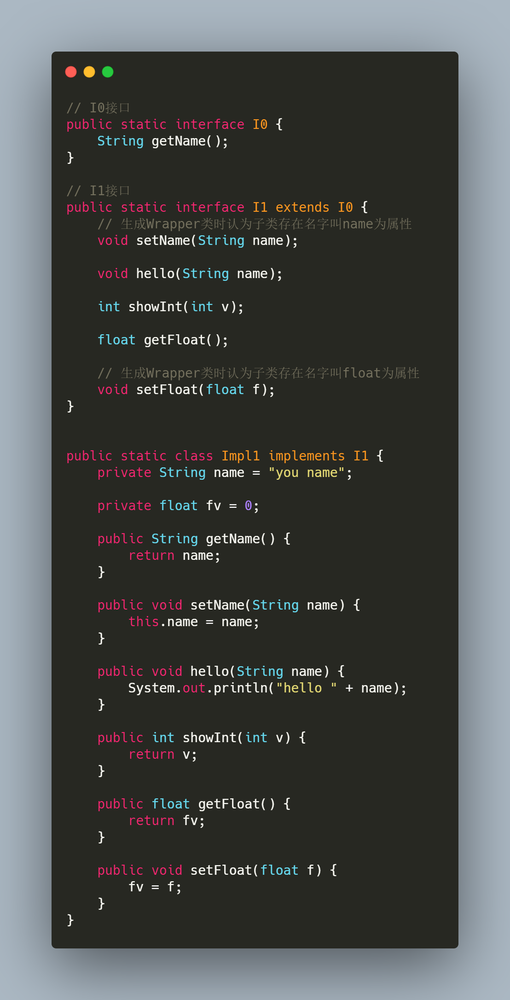

* 官方的测试用例(我添加了一些注释)

  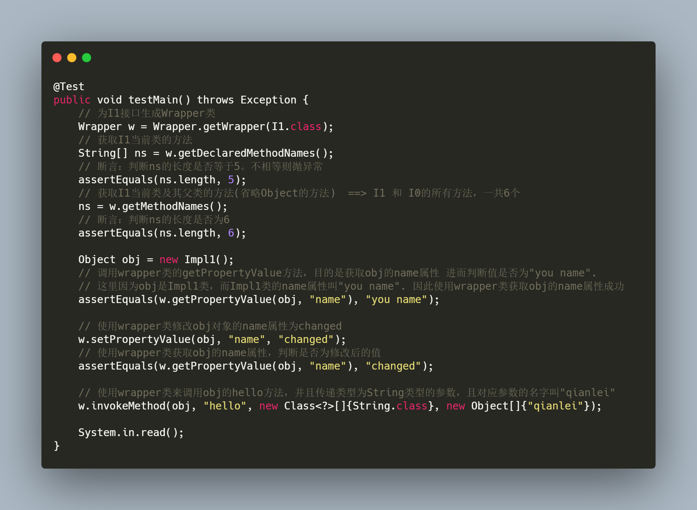

### 1.2 I1类生成的Wrapper类

* 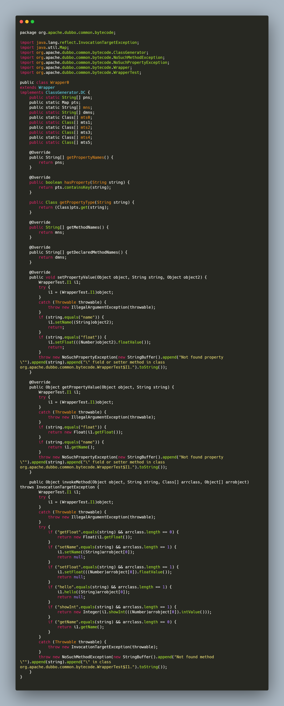

### 1.3 根据生成的Wrapper类来拆解测试用例

* 分析测试用例中使用**I1**的Wrapper对象来**动态**的**获取**和**设置**I1实现类的属性

  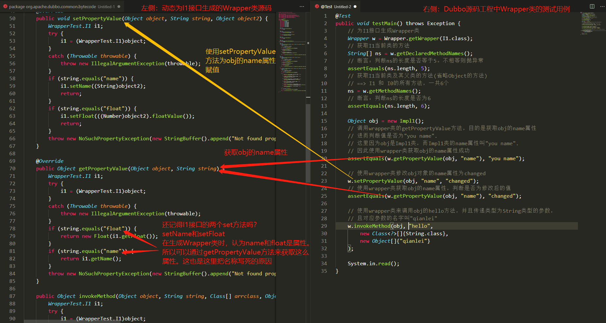

* 分析测试用例中使用**I1**的Wrapper对象来动态的调用I1实现类的指定方法

  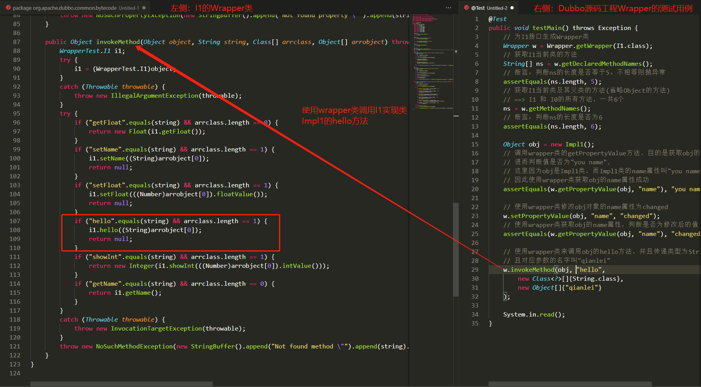

### 1.4 总结

* **由上述测试用例的分析来看，Wrapper类类似于一个委托者。它是一个接口的委托者，我们可以通过这个Wrapper类来动态的调用实现类的方法。同时它也是一个接口的描述，它存放了接口中的所有描述(方法和常量)**

## 二、org.apache.dubbo.rpc.ProxyFactory类的作用

### 2.1 org.apache.dubbo.rpc.ProxyFactory源码

* 在Dubbo中，org.apache.dubbo.rpc.ProxyFactory类的主要作用为**代理工厂**。顾名思义，就是生成代理对象的工厂。其源码如下所示：

  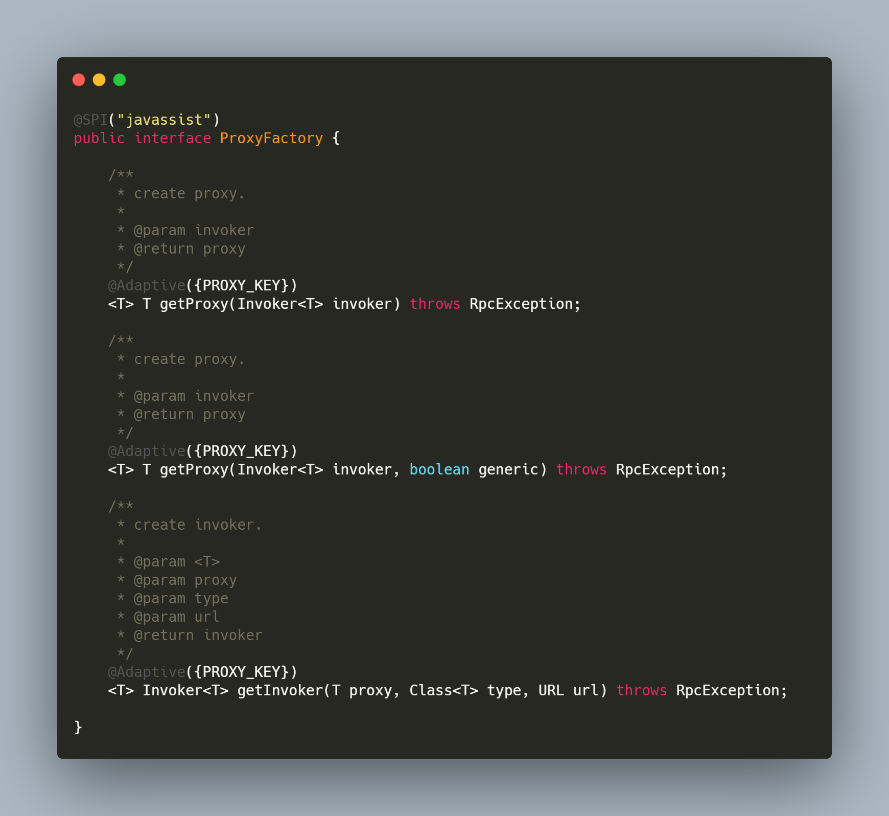

  如上所示，它是一个SPI扩展类，在Dubbo源码中，你可以在很多地方看到如下代码：

  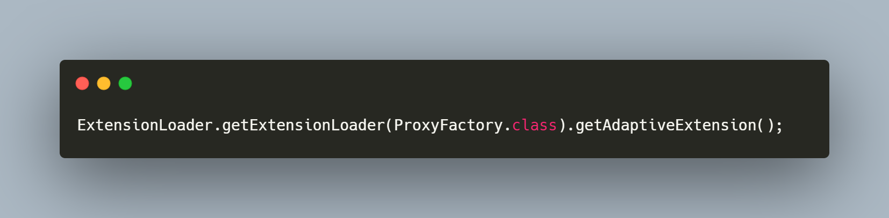

  其主要的目的就是获取到它的**自适应扩展类**。

### 2.2 查看ProxyFactory的自适应扩展类

* 在Dubbo源码工程中，并没有显示的指定某个类为ProxyFactory的自适应扩展类，因此，它的扩展类是Dubbo动态生成的，其动态生成的扩展类源码如下：

  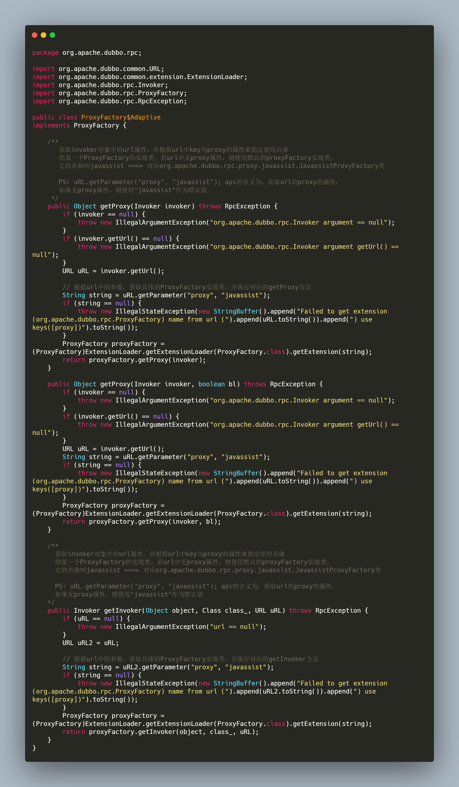

### 2.3 Dubbo中ProxyFactory默认的实现：JavassistProxyFactory

* 在Dubbo源码中有这么一个注释：

  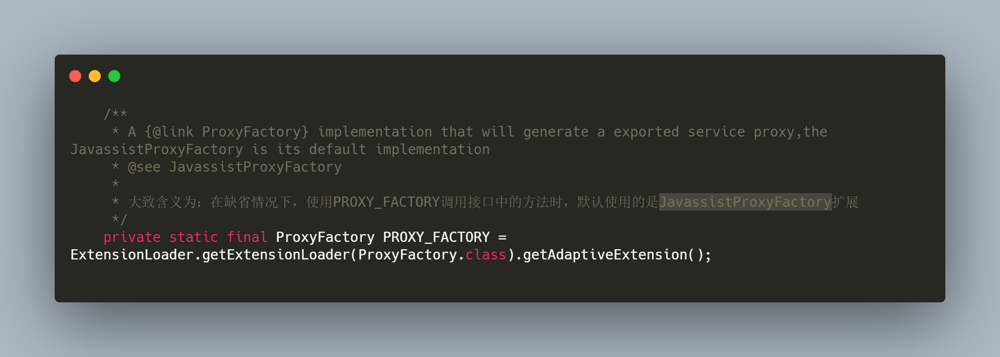

  大致含义为：**在缺省情况下，使用PROXY_FACTORY调用接口中的方法时，默认使用的是JavassistProxyFactory扩展**。因此，我们可以确定，当使用

  PROXY_FACTORY调用getProxy或者getInvoker方法时，最终走的都是JavassistProxyFactory类。

### 2.4 JavassistProxyFactory类源码

* 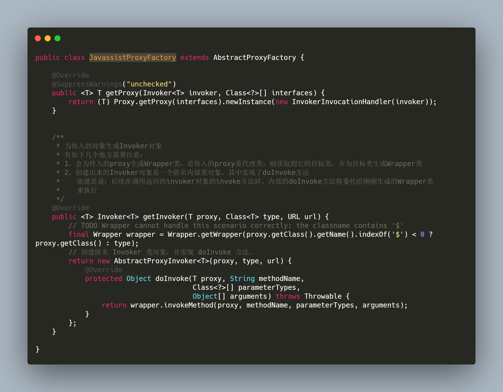

  有一个注意点：**通过JavassistProxyFactory类获取的invoker对象是AbstractProxyInvoker的匿名内部类（这里采用了`模板方法`的设计模式，将invoke方法通用逻辑放在抽象类中，而invoke内部的doInvoke逻辑则交由子类实现）。因此，我们后续调用JavassistProxyFactory类创建的invoker对象的invoke方法时，最终会调用到AbstractProxyInvoker抽象类的invoke方法，然后内部的invoke逻辑则委托给Wrapper来调用**

### 2.5  Dubbo源码工程测试用例：org.apache.dubbo.rpc.proxy.AbstractProxyTest#testGetInvoker

* 源码如下所示：

  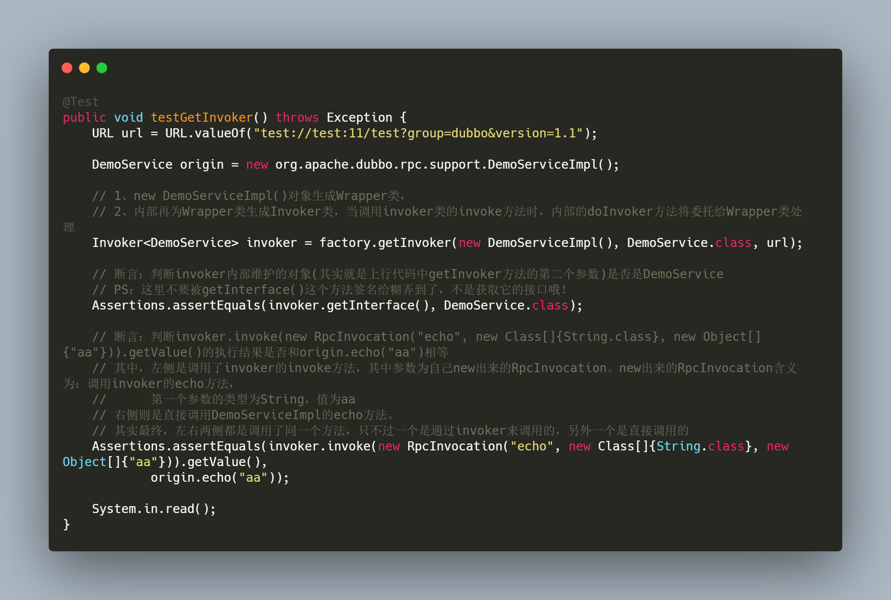

* 当我们调用**invoker.invoke(new RpcInvocation("echo", new Class[]{String.class}, new Object[]{"aa"}))**方法时，由上章节可知，invoker对象就是

  **AbstractProxyInvoker**的匿名内部类。因此，此时肯定调用的是**AbstractProxyInvoker**的**invoke方法**。

  其调用链如下所示：

  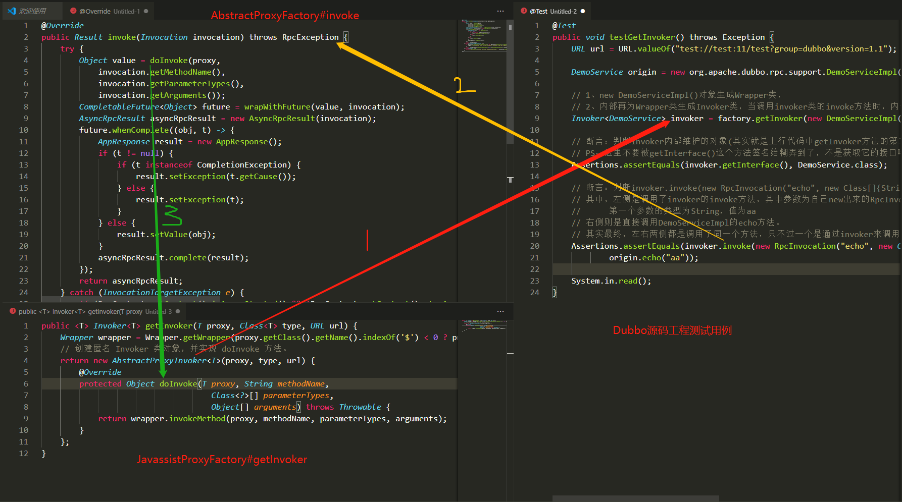

### 2.6 总结

* 由上可知，在缺省情况下， Dubbo的ProxyFactory的自适应扩展类的getInvoker方法最终获取的是一个匿名内部类，并且匿名内部类的doInvoke逻辑将委托给

  新生成的Wrapper类来执行。而getProxy方法就是为传入的对象生成一个代理对象。

  其中，**invoker对象的调用需要传入一个Invocation对象，在Invocation对象中指定了在委托给Wrapper对象执行doInvoker逻辑时的指定方法、指定参数类型、指定参数值**

## 三、总结

* 本次总结大概围绕了**org.apache.dubbo.common.bytecode.Wrapper**和**org.apache.dubbo.rpc.ProxyFactory**两个核心进行介绍。因为在后续服务导出和服

  务引入的源码中会经常看到ProxyFactory的自适应扩展类以及Wrapper来包装一个服务的代码。因此，在这特意做一下总结，方便后续服务导出和服务引入源

  码的阅读。

* 再次总结下：

  ```txt
  1、在默认情况下，我们都是通过JavassistProxyFactory获取Invoker对象，它返回的是AbstractProxyFactory的匿名内部类，内部的doInvoker方法将委托给Wrapper类来执行。
  2、当我们要调用invoker对象的invoke方法时，需要传递一个Invocation对象，其中要指定调用内部Wrapper对象的方法名、参数类型、参数值
  3、Wrapper类是一个有接口的描类。我们可以通过wrapper类调用它内部指定方法，也可以通过它来调用不同实现类的方法。
  ```

  一般情况下：invoker会和wrapper类结合使用，在**服务暴露**和**服务引入**时他们会经常出现，而且他们一定的关联关系，服务暴露来说，他们具有如下关系(**看不懂没关系，将在服务暴露过程中详细解释**)：

  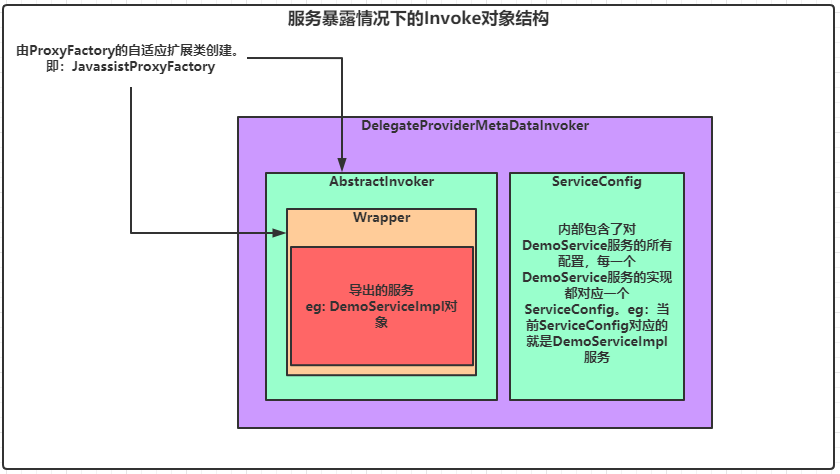

* **I'm a slow walker, but I never walk backwards**


