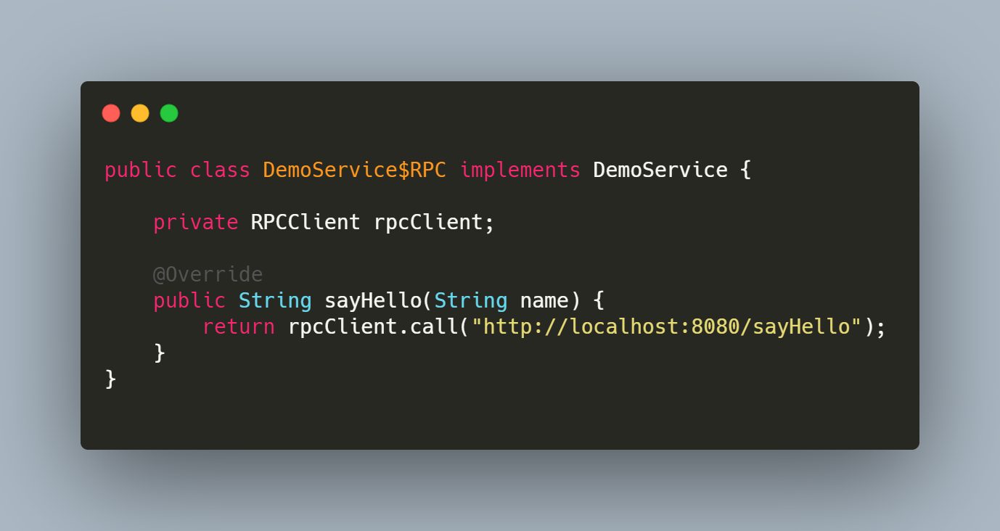
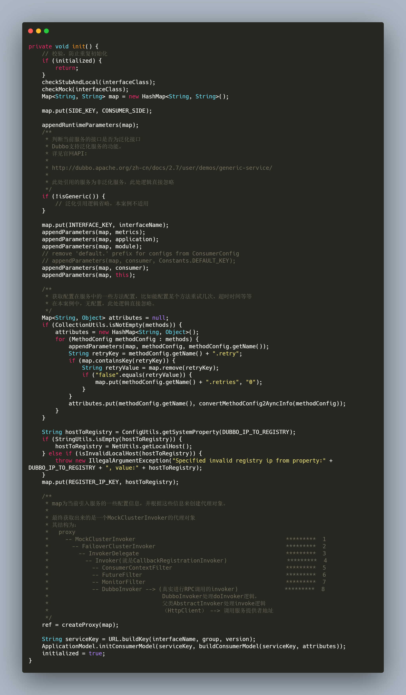

## 前言

* [上篇文章: Dubbo2.7.3版本源码学习系列六: Dubbo服务导出源码解析](https://blog.csdn.net/avengerEug/article/details/109438274)咱们了解了**服务导出**的过程，这里再提一下，服务导出分为三个阶段

  ```txt
  1、前置工作：主要用于检查参数、组装URL <=====> 类似于Spring在初始化bean时定义的一系列BeanDefinition
  2、导出服务：包括服务导出到本地和导出到远程
  3、服务注册：向注册中心注册当前被导出的服务
  ```

* 本篇文章，咱们继续往下走，进入Dubbo服务引入的源码解读。

## 一、服务引入的两种方式

* 引入[官方文档内容：服务引入简介](http://dubbo.apache.org/zh-cn/docs/2.7/source_code_guide/refer-service/#1)：

  > 在 Dubbo 中，我们可以通过两种方式引用远程服务。第一种是使用服务直连的方式引用服务，第二种方式是基于注册中心进行引用。

  官网建议我们，服务直连的方式适合在调试和测试环境下使用。生产环境推荐使用注册中心引用。因此，咱们按着官网的节奏来，着重关注使用注册中心引用服务的过程。

## 二、思考一个问题

* 在Dubbo源码工程的demo模块中，有如下一段消费者远程调用的代码。**如果是你，你会怎么设计从spring容器中获取DemoService对象，并且具备远程调用功能？**

  ```java
  DemoService demoService = context.getBean("demoService", DemoService.class);
  String hello = demoService.sayHello("world");
  ```

  > 由上可知，我们在消费端利用Spring上下文对象获从Spring容器中获取DemoService类型的bean，并且调用了对应的sayHello方法。这个bean究竟是怎么个结构？我们的消费端明明就没有DemoService的实现类，那它是怎么获取到的？根据上面的疑问，我们衍生出了三个问题：
  >
  > 1、它的实现类是什么时候生成的？
  >
  > 2、以及什么时候加到spring容器中去的？
  >
  > 3、这个实现类是怎么调用到远程方法的？

  咱们带着这三个问题继续往下看。

## 三、解释上述提出的三个问题

* 现在是微服务时代，相信大家肯定用过SpringCloud框架吧。如果没用过也没关系，那肯定用过MyBatis ORM框架吧。我们在使用MyBatis框架时，大家可以很方便的把dao层的实现类给忽略了，直接写一个mapper接口就能实现CRUD操作，并且也能在service层依赖注入了。能实现这样的功能就是因为Spring框架的**FactoryBean**扩展点，而Dubbo在进行服务引入时，就充分利用了FactoryBean功能，Dubbo的ReferenceBean类实现了FactoryBean接口，并在getObject方法中为DemoService接口生成了代理类，并且，我们能从spring容器中获取到这个代理类(FactoryBean知识点)。因此，通过使用FactoryBean扩展点的功能后，咱们的DemoService的实现类(代理类)也生成了，也添加到Spring容器中去了。如果，我们在生成代理类的过程中，对sayHello方法逻辑进行增强，在内部添加了远程调用的功能(发送http请求给远程服务)，那是不是就实现了远程方法的调用？生成的代理类的伪代码如下所示：

  

  怎么样？是不是觉得思路很简单？没有实现类，咱们就动态生成一个实现类，并且这个实现类具备远程调用功能。当然，这只是咱们的实现方式，对于Dubbo而言，他肯定包含更多的功能，比如**过滤器、服务容错机制**等等。有了这么一个思路，咱么就开始进入Dubbo的服务引用源码分析吧。

## 四、官网实现服务引用的原理

* 再次引入[官方文档内容：服务引用原理](http://dubbo.apache.org/zh-cn/docs/2.7/source_code_guide/refer-service/#2)：

  > Dubbo 服务引用的时机有两个，第一个是在 Spring 容器调用 ReferenceBean 的 afterPropertiesSet 方法时引用服务，第二个是在 ReferenceBean 对应的服务被注入到其他类中时引用。这两个引用服务的时机区别在于，第一个是饿汉式的，第二个是懒汉式的。默认情况下，Dubbo 使用懒汉式引用服务。如果需要使用饿汉式，可通过配置 \<dubbo:reference> 的 init 属性开启。下面我们按照 Dubbo 默认配置进行分析，整个分析过程从 ReferenceBean 的 getObject 方法开始。当我们的服务被注入到其他类中时，Spring 会第一时间调用 getObject 方法，并由该方法执行服务引用逻辑。按照惯例，在进行具体工作之前，需先进行配置检查与收集工作。接着根据收集到的信息决定服务用的方式，有三种，第一种是引用本地 (JVM) 服务，第二是通过直连方式引用远程服务，第三是通过注册中心引用远程服务。不管是哪种引用方式，最后都会得到一个 Invoker 实例。如果有多个注册中心，多个服务提供者，这个时候会得到一组 Invoker 实例，此时需要通过集群管理类 Cluster 将多个 Invoker 合并成一个实例。合并后的 Invoker 实例已经具备调用本地或远程服务的能力了，但并不能将此实例暴露给用户使用，这会对用户业务代码造成侵入。此时框架还需要通过代理工厂类 (ProxyFactory) 为服务接口生成代理类，并让代理类去调用 Invoker 逻辑。避免了 Dubbo 框架代码对业务代码的侵入，同时也让框架更容易使用。

### 4.1 服务引用的两个时机(统一入口)

* 在官网的文档中说明了服务引用的时机有两个：第一个是ReferenceBean 的 afterPropertiesSet 方法。第二个是ReferenceBean 对应的服务被注入到其他类中时引用。其实，不管是上述的哪一种(**默认是第二种**)，最终都会进入**org.apache.dubbo.config.spring.ReferenceBean#getObject**方法。因此，我们把目光定位到**org.apache.dubbo.config.spring.ReferenceBean#getObject**方法，其内部最终会调用到**org.apache.dubbo.config.ReferenceConfig#init**方法

## 五、以官网源码工程的消费者demo为例，解析服务引入

* 以dubbo-demo-xml-consumer模块为例，其中main方法和xml配置文件如下所示：

  ```java
  // main
  public static void main(String[] args) throws IOException {
      ClassPathXmlApplicationContext context = new ClassPathXmlApplicationContext("spring/dubbo-consumer.xml");
      context.start();
      DemoService demoService = context.getBean("demoService", DemoService.class);
      String hello = demoService.sayHello("world");
      System.out.println("result: " + hello);
      System.in.read();
  }
  ```

  ```xml
  <dubbo:application name="demo-consumer"/>
  <dubbo:registry address="zookeeper://127.0.0.1:2181" />
  <dubbo:reference id="demoService" check="false" interface="org.apache.dubbo.demo.DemoService"/>
  ```

* 通过之前Dubbo系列的学习，**<dubbo:reference />**标签最终会对应ReferenceBean。由上述的分析，最终服务引入会定位到**org.apache.dubbo.config.ReferenceConfig#init**方法，该方法及其源码注释如下所示：

  

