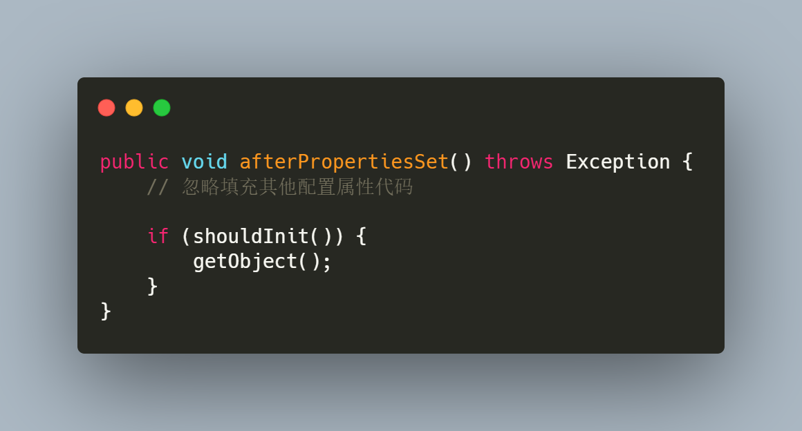
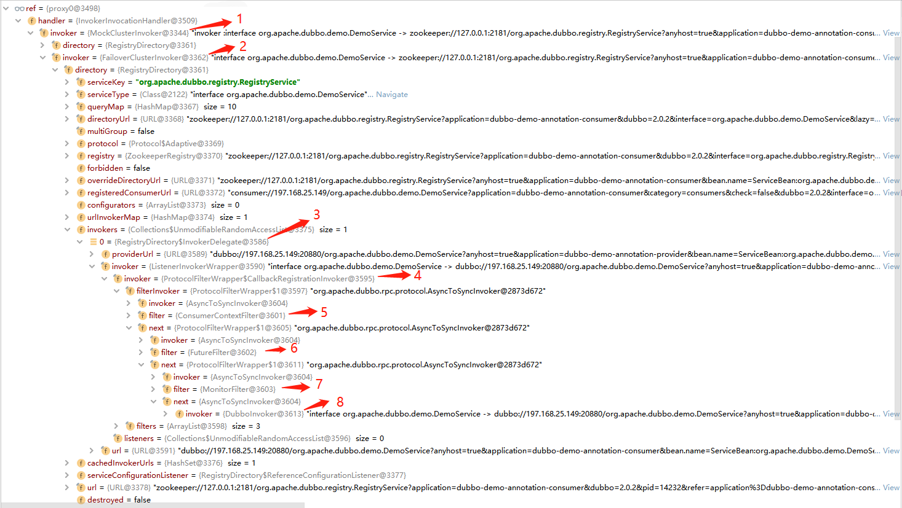
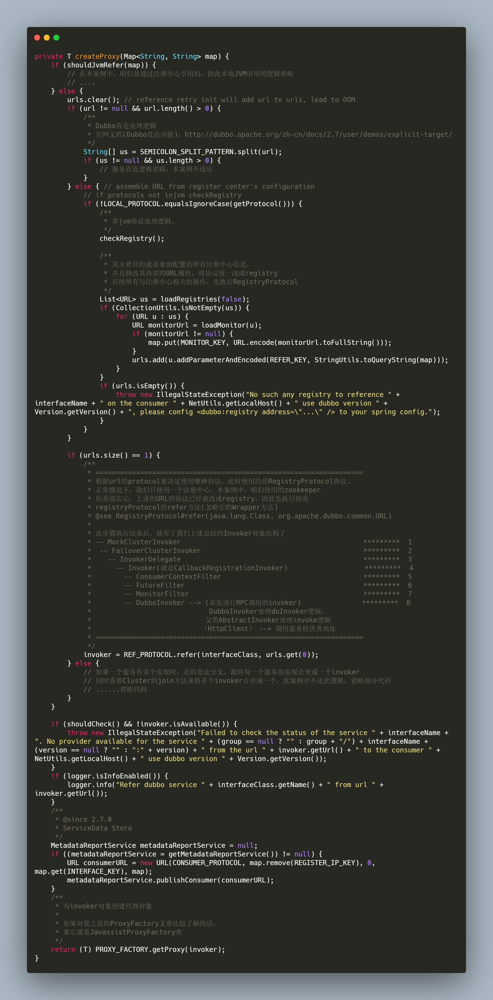
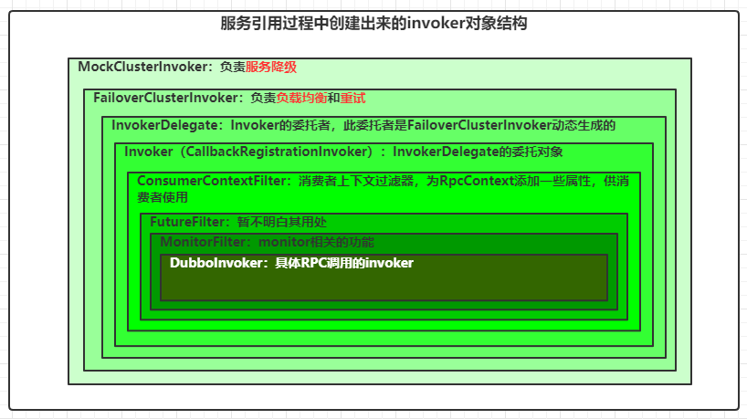
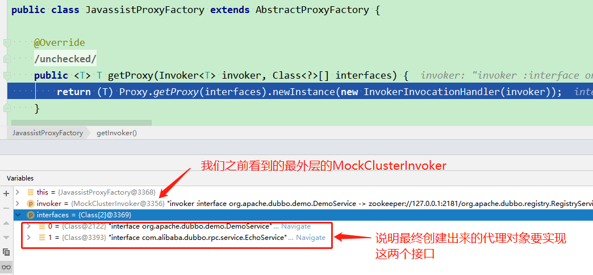
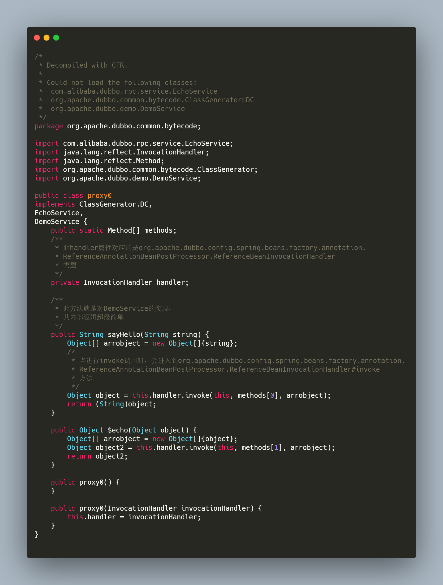

## 前言

* [上篇文章: Dubbo2.7.3版本源码学习系列六: Dubbo服务导出源码解析](https://blog.csdn.net/avengerEug/article/details/109438274)咱们了解了**服务导出**的过程，这里再提一下，服务导出分为三个阶段

  ```txt
  1、前置工作：主要用于检查参数、组装URL <=====> 类似于Spring在初始化bean时定义的一系列BeanDefinition
  2、导出服务：包括服务导出到本地和导出到远程
  3、服务注册：向注册中心注册当前被导出的服务
  ```

* 本篇文章，咱们继续往下走，进入Dubbo服务引入的源码解读。

## 一、服务引入的两种方式

* 引入[官方文档内容：服务引入简介](http://dubbo.apache.org/zh-cn/docs/2.7/source_code_guide/refer-service/#1)：

  > 在 Dubbo 中，我们可以通过两种方式引用远程服务。第一种是使用服务直连的方式引用服务，第二种方式是基于注册中心进行引用。

  官网建议我们，服务直连的方式适合在调试和测试环境下使用。生产环境推荐使用注册中心引用。因此，咱们按着官网的节奏来，着重关注使用注册中心引用服务的过程。

## 二、思考一个问题

* 在Dubbo源码工程的demo模块中，有如下一段消费者远程调用的代码。**如果是你，你会怎么去设计从spring容器中获取DemoService对象，并且具备远程调用功能？**

  ```java
  DemoService demoService = context.getBean("demoService", DemoService.class);
  String hello = demoService.sayHello("world");
  ```

  > 由上可知，我们在消费端利用Spring上下文对象从Spring容器中获取DemoService类型的bean，并且调用了对应的sayHello方法。这个bean究竟是怎么个结构？**我们的消费端明明就没有DemoService的实现类，那它是怎么获取到的，换句话说就是什么时候创建了实现类并放入到了spring容器**？根据上面的疑问，我们衍生出了三个问题：
  >
  > 1、它的实现类是什么时候生成的？
  >
  > 2、以及什么时候加到spring容器中去的？
  >
  > 3、这个实现类是怎么调用到远程方法的？

  咱们带着这三个问题继续往下看。

## 三、解释上述提出的三个问题

* 现在是微服务时代，相信大家肯定用过SpringCloud框架吧。如果没用过也没关系，那你一定用过MyBatis ORM框架！我们在使用MyBatis框架时，大家可以很方便的忽略dao层的实现类，直接写一个mapper接口就能实现CRUD操作，并且也能在service层依赖注入。能实现这样的功能就是因为Spring框架的**FactoryBean**扩展点，**而Dubbo在进行服务引入时，就充分利用了FactoryBean功能**，**Dubbo的`ReferenceBean`类实现了FactoryBean接口，并在getObject方法中为DemoService接口生成了代理类，并且，我们能从spring容器中获取到这个代理类(FactoryBean知识点)**。因此，通过使用FactoryBean扩展点的功能后，咱们的DemoService的实现类(**代理类**)就生成了，同时也添加到Spring容器中去了。如果，我们在生成代理类的过程中，对sayHello方法逻辑进行增强，在内部添加了远程调用的功能(发送http请求给远程服务)，那是不是就实现了远程方法的调用？生成的代理类的伪代码如下所示：

  

  怎么样？是不是觉得思路很简单？没有实现类，咱们就动态生成一个实现类，并且这个实现类具备远程调用功能。当然，这只是咱们的实现方式，对于Dubbo而言，他肯定包含更多的功能，比如**过滤器、服务容错机制**等等。有了这么一个思路，咱么就开始进入Dubbo的服务引用源码分析吧。

## 四、官网实现服务引用的原理

* 再次引入[官方文档内容：服务引用原理](http://dubbo.apache.org/zh-cn/docs/2.7/source_code_guide/refer-service/#2)：

  > Dubbo 服务引用的时机有两个，第一个是在 Spring 容器调用 ReferenceBean 的 afterPropertiesSet 方法时引用服务，第二个是在 ReferenceBean 对应的服务被注入到其他类中时引用。这两个引用服务的时机区别在于，第一个是饿汉式的，第二个是懒汉式的。默认情况下，Dubbo 使用懒汉式引用服务。如果需要使用饿汉式，可通过配置 \<dubbo:reference> 的 init 属性开启。下面我们按照 Dubbo 默认配置进行分析，整个分析过程从 ReferenceBean 的 getObject 方法开始。当我们的服务被注入到其他类中时，Spring 会第一时间调用 getObject 方法，并由该方法执行服务引用逻辑。按照惯例，在进行具体工作之前，需先进行配置检查与收集工作。接着根据收集到的信息决定服务用的方式，有三种，第一种是引用本地 (JVM) 服务，第二是通过直连方式引用远程服务，第三是通过注册中心引用远程服务。不管是哪种引用方式，最后都会得到一个 Invoker 实例。如果有多个注册中心，多个服务提供者，这个时候会得到一组 Invoker 实例，此时需要通过集群管理类 Cluster 将多个 Invoker 合并成一个实例。合并后的 Invoker 实例已经具备调用本地或远程服务的能力了，但并不能将此实例暴露给用户使用，这会对用户业务代码造成侵入。此时框架还需要通过代理工厂类 (ProxyFactory) 为服务接口生成代理类，并让代理类去调用 Invoker 逻辑。避免了 Dubbo 框架代码对业务代码的侵入，同时也让框架更容易使用。

###  服务引用的两个时机(统一入口)

* 在官网的文档中说明了服务引用的时机有两个：第一个是ReferenceBean 的 afterPropertiesSet 方法。第二个是ReferenceBean 对应的服务被注入到其他类中时引用。其实，不管是上述的哪一种(**默认是第二种**)，最终都会进入**org.apache.dubbo.config.spring.ReferenceBean#getObject**方法（**如下图所示：饿汉式源码，最终也会调用到getObject方法**）。因此，我们把目光定位到**org.apache.dubbo.config.spring.ReferenceBean#getObject**方法，其内部最终会调用到**org.apache.dubbo.config.ReferenceConfig#init**方法

  

## 五、以官网源码工程的消费者demo为例，解析服务引入

* 以dubbo-demo-xml-consumer模块为例，其中main方法和xml配置文件如下所示：

  ```java
  // main
  public static void main(String[] args) throws IOException {
      ClassPathXmlApplicationContext context = new ClassPathXmlApplicationContext("spring/dubbo-consumer.xml");
      context.start();
      DemoService demoService = context.getBean("demoService", DemoService.class);
      String hello = demoService.sayHello("world");
      System.out.println("result: " + hello);
      System.in.read();
  }
  ```

  ```xml
  <!-- dubbo-consumer.xml配置文件 -->
  <dubbo:application name="demo-consumer"/>
  <dubbo:registry address="zookeeper://127.0.0.1:2181" />
  <dubbo:reference id="demoService" check="false" interface="org.apache.dubbo.demo.DemoService"/>
  ```

* 通过之前Dubbo系列的学习，**<dubbo:reference />**标签最终会对应ReferenceBean。由上述的分析，最终服务引入会定位到**org.apache.dubbo.config.ReferenceConfig#init**方法，该方法及其源码注释如下所示：

  

* 其中，生成的代理对象结构如下图所示（Debug查看，对应上图的1-8数字）

  

  如下表格将描述下图中每个数字对应类的作用，具体的作用后续将撰写一篇**服务调用的源码分析总结**，这里先总结下大致含义：

  | 编号 |                          类名                           |                             作用                             |
  | :--: | :-----------------------------------------------------: | :----------------------------------------------------------: |
  |  1   |                   MockClusterInvoker                    | 顾名思义，它是一个mock的invoker，但这个mock与我们常用的mock不一样。它主要的作用是根据我们的配置来进行**服务降级**操作。可通过配置中心动态配置服务的降级配置，来达到降级的目的。 |
  |  2   |                 FailoverClusterInvoker                  | 顾名思义，它是一个故障转移的invoker。它主要的作用是来进行**负载均衡**和**重试机制**。其主要是根据配置的负载均衡策略选择一个invoker，同时使用InvokerDelegate来包装，即最终获取的对象是编号3的InvokerDelegatei对象 |
  |  3   | InvokerDelegate（RegistryDirectory类的InvokerDelegate） | 顾名思义，它一个委托者，委托的对象是Invoker对象，这个invoker对象不是固定的，取决于上述**FailoverClusterInvoker**负载均衡后选择的invoker对象，其实就是下面的invoker对象 |
  |  4   |       Invoker（就是CallbackRegistrationInvoker）        | 此Invoker就是编号3中的InvokerDelegate委托的invoker对象。在此对象的invoke方法中，会调用下面编号5-8列举的四个过滤器（可配置自己自定义的过滤器） |
  |  5   |                  ConsumerContextFilter                  |               只是在RpcContext中放置了很多参数               |
  |  6   |                      FutureFilter                       |                           暂不清楚                           |
  |  7   |                      MonitorFilter                      | 相当于埋点吧，在RpcContext中添加一些当前服务配置的monitor信息 |
  |  8   |                      DubboInvoker                       |     主角：它的就用就是我们文章开头所说的，进行RPC调用。      |

## 六、createProxy创建代理对象

* 其源码及其注释如下所示：

  

* 关于`REF_PROTOCOL.refer(interfaceClass, urls.get(0))`代码生成invoker对象的逻辑，我不打算在本文中继续列举出来了，它内部充分利用了zookeeper节点的监听，通知机制。大量的**观察者设计模式**比较容易绕晕，同时内部也包含了**cluster对象对多个invoker的合并过程**。因此，我们按照**黑箱理论**来理解就行了。我们只需要知道，最终引用出来的对象结构以及内部每一个包含的含义即可（**如上述图中的表格**），同时，为了方便理解，我还描绘了一张图来更直观的查看引用出来的invoker对象结构：

  

  我用了颜色逐渐抵深的策略，来描述invoker对象，颜色最深处，则代表着invoker调用结束，即真实的RPC调用结束。

* 我们只是了解了invoker对象的结构，但是它终究不是我们服务提供者的类型，因此还需要一个步骤，就是将invoker对象转化成服务提供者的类型，其核心代码就来到了`return (T) PROXY_FACTORY.getProxy(invoker)`代码。同上，在我的[Dubbo2.7.3版本源码学习系列五: 学习Dubbo服务导出源码前置知识点(ProxyFactory和Wrapper类)](https://blog.csdn.net/avengerEug/article/details/109340657)文章中，有专门总结ProxyFactory类，并且使用**Arthas**工具对ProxyFactory的自适应扩展类进行了反编译操作。在默认情况下，这个ProxyFactory就是**JavassistProxyFactory**类。我们debug后的结果如下所示：

  

  由上所示，我们最终创建出来的代理对象会实现两个接口，以及被代理对象是我们上述花了大量时间总结的MockClusterInvoker对象。至于Dubbo如何生成这个代理对象的逻辑我也不打算在这里进行总结了，这里使用的是Dubbo自己自研的动态代理方案，其实现方案就是将一个类的完整信息，包括对上述两个接口的方法的实现，然后动态编译成class文件，再使用反射创建对象。在使用Arthas工具来反编译代理后的对象的源码为如下所示：

  

  如同我们分析的一样，代理对象最终实现了**EchoService和DemoService**接口，关于它内部如何调用的过程我们在后续的**服务调用流程**的总结在细说。

## 七、总结

* 可能有的人还是很模糊，我们一开始的上述三个问题好像还没有一一解决，下面我们来对上述提出的三个问题做一个总结性的回答

  > 1、它的实现类是什么时候生成的？
  >
  > 答：相信通过上述的分析我们应该很明白了，它的实现类就是在**JavassistProxyFactory**生成代理对象时动态产生的。
  >
  > 2、以及什么时候加到spring容器中去的？
  >
  > 答：此问题属于spring的FactoryBean知识点，FactoryBean的getObject方法返回的对象也会被加入到spring容器中去。
  >
  > 3、这个实现类是怎么调用到远程方法的？
  >
  > 答：此问题也比较简单，上面也说到过，是在DubboInvoker的**org.apache.dubbo.rpc.protocol.dubbo.DubboInvoker#doInvokes**方法完成的。

* 本次服务引入的总结，咱们对引入出来的invoker对象的结构以及内部维护的每个对象的作用都有了一个大概的了解。当然，对于FutureFilter而言，还不清楚它的实际作用，希望能后续再来补充它。

* **如果你觉得我的文章有用的话，欢迎点赞、收藏和关注。:laughing:**

* **I'm a slow walker, but I never walk backwards**

