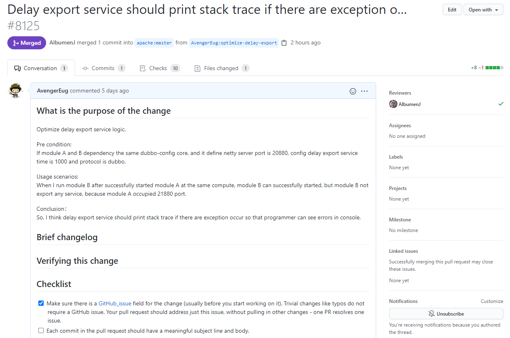
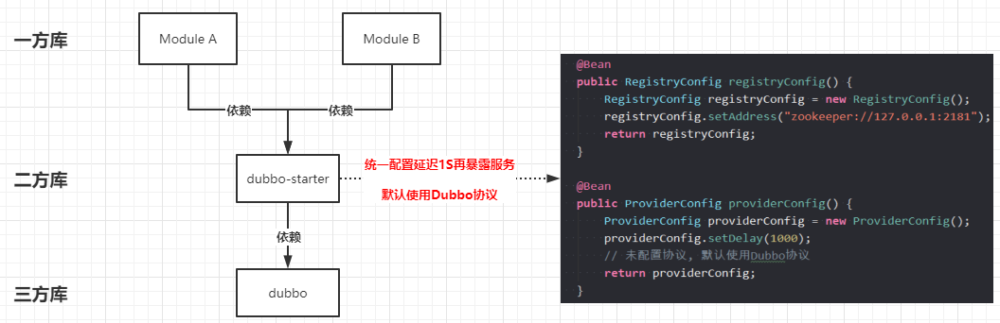
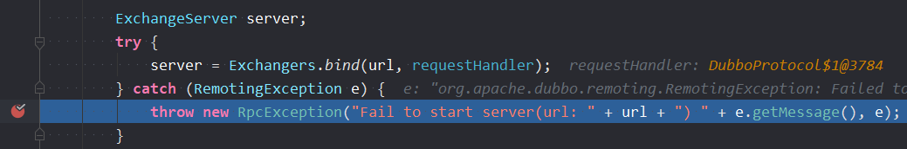
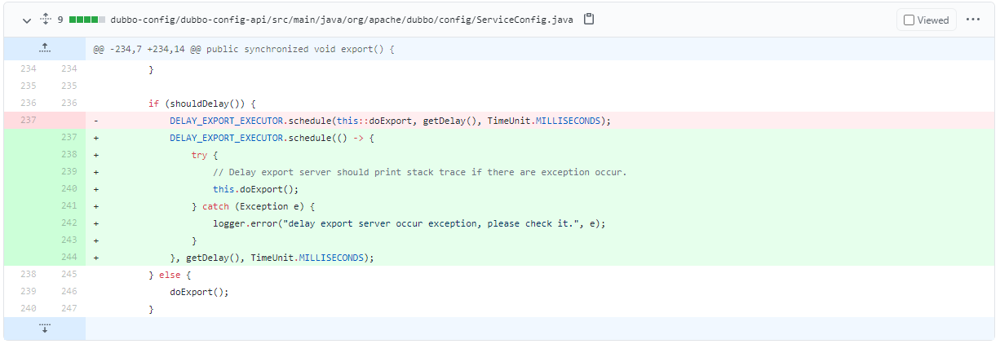
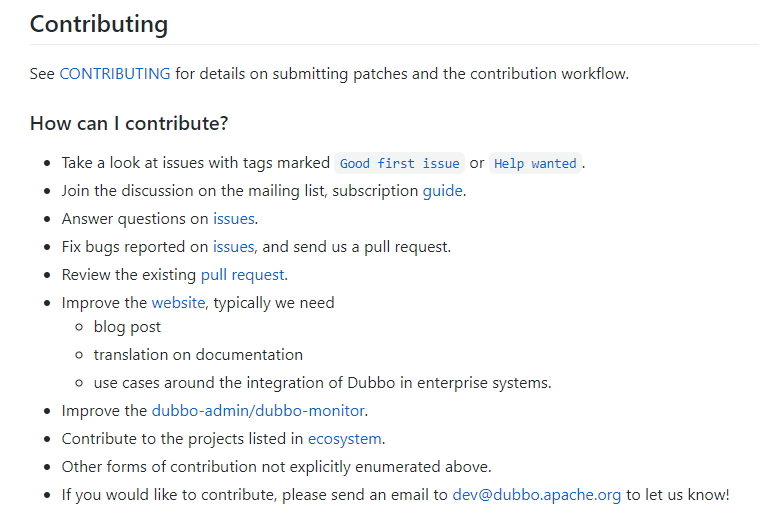
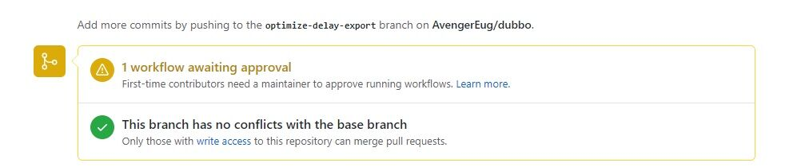
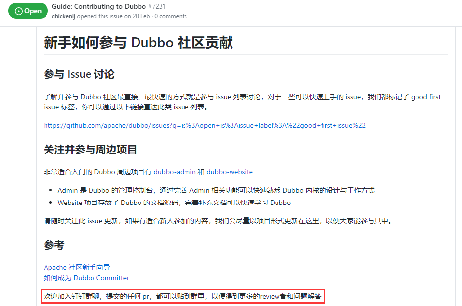
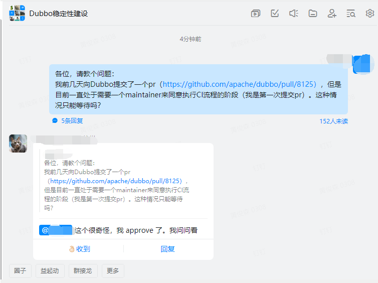
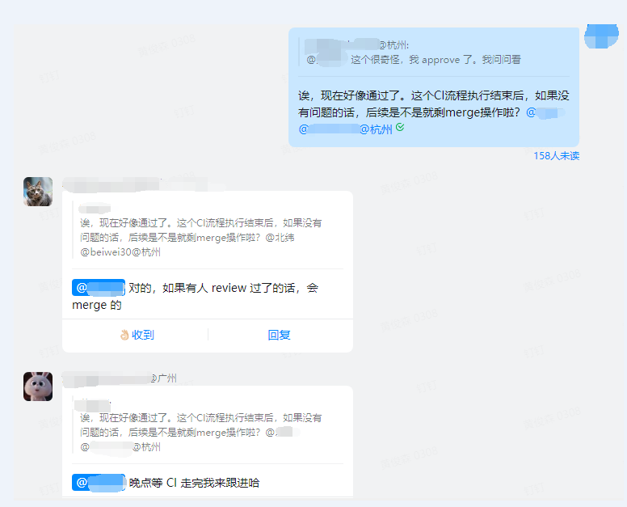

# 滑稽之事：学习Spring源码半年后，我成为了Dubbo的贡献者

## 前言

* 2021年6月23日，我向Dubbo发起了我**人生中第一个开源框架的PR**(pull request)，就在今天（2021年6月28日），被maintainer merge了。是的，这是值得记录的一天！借此机会，我想把我的历程记录下来。

## 一、提交的PR的内容是什么？

* 我提交的PR的内容是什么？换句话说：我发现了Dubbo的什么[bug（添加查看PR）](https://github.com/apache/dubbo/pull/8125)? 

  

* 大致的背景就是：项目中的模块A和模块B同时依赖的相同的二方库dubbo-starter，并且这个二方库内部定义了协议为Dubbo、Netty的服务端口为20880、每个服务提供者需要延迟暴露1S。其大概模型图如下所示：

  

  在这种情况下，当我在同一台电脑上先启动模块A项目，待模块A项目启动完成后再启动模块B。你会发现：模块B能`“正常启动”`，控制台上没有任何报错，**给人一种运行正常、毫无问题的错觉。实际上，模块B仅仅是一个空壳，内部的服务没有一个`导出成功`**。其主要原因就是在如下代码中抛出了异常（**模块B内置的Netty服务在启动过程中发现20880端口被占用了，抛出了端口被占用的异常**）：

  

  但控制台中没有任何输出。控制台上为什么没有输出？**这就是问题所在了**！于是，我跟着方法调用栈一步步跟踪，最终发现了这么一段代码：

  ```java
  // 方法坐标：com.alibaba.dubbo.config.ServiceConfig#export
  if (shouldDelay()) {
      DELAY_EXPORT_EXECUTOR.schedule(this::doExport, getDelay(), TimeUnit.MILLISECONDS);
  } else {
      doExport();
  }
  ```

  这是Dubbo服务导出的一段源码，根据我们的配置来决定是执行延迟导出的逻辑还是立即导出逻辑。由于我们的dubbo-starter二方库中配置了延迟1S，因此走的是`@1`处代码的逻辑。看到这段代码，很明显，这里用的就是JDK的延迟任务线程池，但没有对内部线程的异常情况做任何处理，换句话说：**这里的异常被吃掉了！**就是因为这个异常被吃掉了，我们无法感知模块B在导出服务时发生了异常。

* 发现这个bug后，我脑海中的第一个想法就是：捕获异常，打印日志。因此，这个PR的改动也非常简单：

  

  **仅仅是打印异常而已。**

## 二、如何发起PR？

* 当我发现这个bug并作出修改后，下一个问题来了：我要怎么发起PR呢？这个我也是参考了网上的相关内容，这个比较容易，就不一一阐述了。但在发PR之前一定要注意一点：**一定要阅读开源框架对Contributing的说明（开发框架的社区非常庞大，每一个PR必须得符合规范才行）**。在Dubbo的Github[首页](https://github.com/apache/dubbo)中就有对贡献相关的说明：

  

  对于Dubbo而言：回答一个问题、修复一个bug都能算作是为开源框架做出了贡献。相对来说，门槛还是比较低的。

## 三、提交PR后，还经历了什么？

* Dubbo团队针对于第一次发起贡献的参与者有一个要求：

  

  需要一个maintainer来同意这个CI操作。但是问题来了：我没有认识的maintainer，难道我只能安静的等待吗？是的，对于没有经验的我，傻傻等了5天后，依然发现CI流程没有被批准。在网上查阅了一番资料后，终于在此[Issue](https://github.com/apache/dubbo/issues/7231)中找到了我想要的信息：

  

  看到这个信息的我，心里暗喜：群里一定有许多的China大佬，终于不需要依赖翻译了。申请入群成功并经过一番沟通后：

  

  

  终于被maintainer关注了。当然，不出我所料，PR最终也被merge了。就这样，我也成为了开源框架的一位贡献者，此刻，我为自己自豪！

## 四、最后

* **就如标题一样，我看得最多的是开源框架Spring的源码，但最终却成了Dubbo的贡献者，确实有点滑稽。但不可否认的是：看源码的套路都是一样的，也感谢自己有这么一个贡献开源框架的经历。今天，确实值得纪念！**
* **如果你觉得我的文章有用的话，欢迎点赞和关注。:laughing:**
* **I'm a slow walker, but I never walk backwards**

