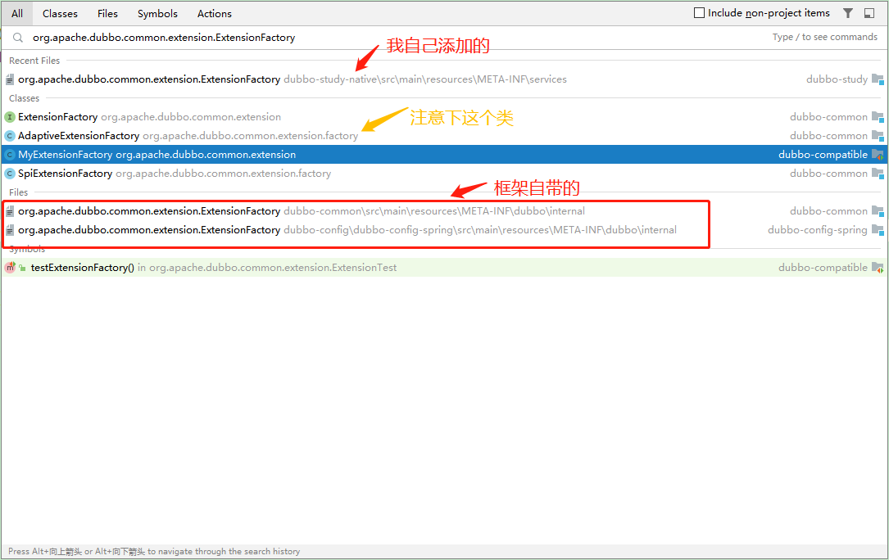
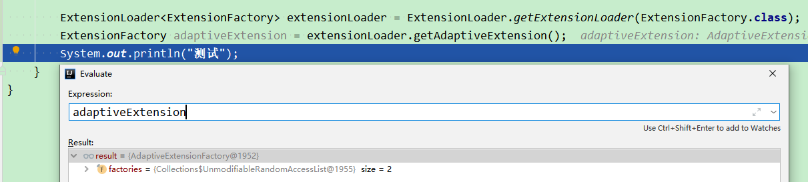
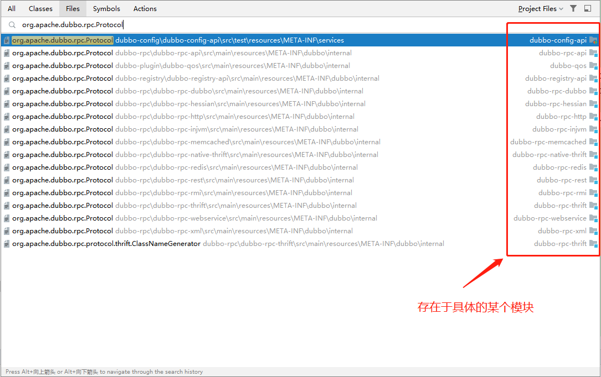
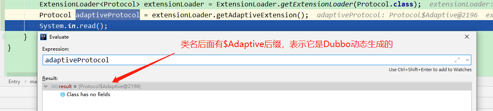
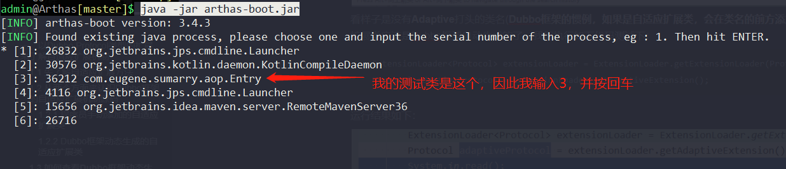
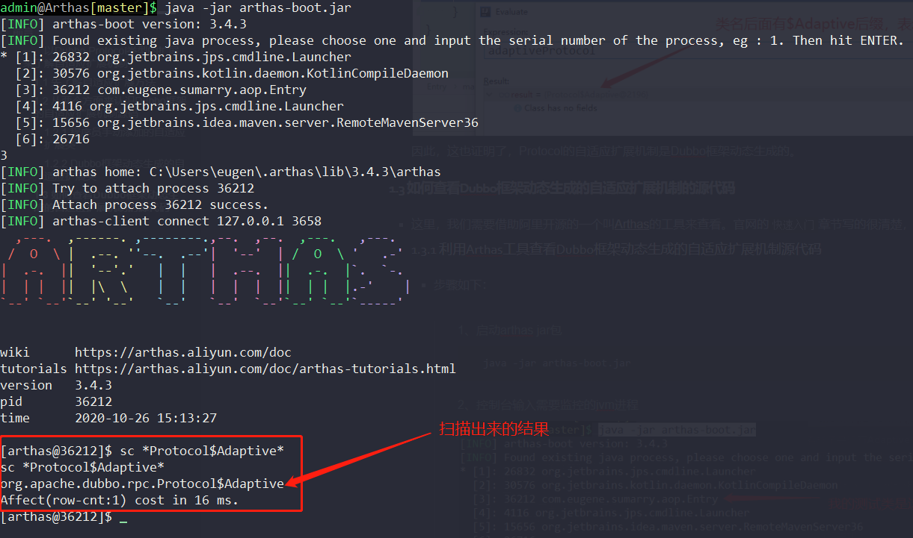

# 前言
* 今天，咱们来聊聊Dubbo的自适应扩展机制。**PS：此功能比较重要，是Dubbo的一个比较核心的功能，后续的源码中都能看到它的身影**
* 刚刚说到了Dubbo**自适应扩展机制**的重要性，那么到底什么叫**自适应扩展机制呢？**，我来引用[官网](http://dubbo.apache.org/zh-cn/docs/source_code_guide/adaptive-extension.html)中的话：

	> 有时，有些拓展并不想在框架启动阶段被加载，而是希望在拓展方法被调用时，根据运行时参数进行加载。这听起来有些矛盾。拓展未被加载，那么拓展方法就无法被调用（静态方法除外）。拓展方法未被调用，拓展就无法被加载。对于这个矛盾的问题，Dubbo 通过自适应拓展机制很好的解决了

## 一、以Dubbo Protocol类型的扩展来了解自适应扩展机制
* 我们都知道，Dubbo中支持很多协议：**dubbo、redis、http等等**。大家不用被协议这两个字吓唬到了，其实所谓的协议就是一些规则，比如咱们在商店里花了3块钱买了一瓶瓶装的百事可乐，那么这就是一个规则，我们也可以把它称作为**百事可乐协议**。大家只需要知道，在使用dubbo中，使用不同的协议时，就会获取不同的协议来执行相应的逻辑，你也可以理解成这就是一种**策略者设计模式**。

### 1.1 先了解自适应扩展方法
* 在Dubbo中，一切扩展均以SPI机制进行加载，而SPI涉及的ExtensionLoader已经在之前的Dubbo系列总结过了，这里就不赘述了。而要使用Dubbo的自适应扩展机制，首先得从**org.apache.dubbo.common.extension.ExtensionLoader#getAdaptiveExtension**方法说起，此方法的主要核心定位于内部调用的**org.apache.dubbo.common.extension.ExtensionLoader#getAdaptiveExtensionClass**方法，其中方法的源码如下：
	```java
	private Class<?> getAdaptiveExtensionClass() {
	    // 这个步骤完成后，当前ExtensionLoader对应type的spi文件全部加载完成，同时当前
	    // ExtensionLoader的cachedClasses属性中存了所有type的实现类
	    getExtensionClasses();
	
	    /**
	         * 如果当前ExtensionLoader对应type的spi配置的实现类中有@Adaptive注解标识的类，则直接返回它
	         * cachedAdaptiveClass的缓存是在如下方法中完成的
	         * @see ExtensionLoader#loadClass(java.util.Map, java.net.URL, java.lang.Class, java.lang.String)
	         */
	    if (cachedAdaptiveClass != null) {
	        return cachedAdaptiveClass;
	    }
	
	    // 由框架创建自适应扩展类
	    return cachedAdaptiveClass = createAdaptiveExtensionClass();
	}
	```

### 1.2 从两个方面来认识Dubbo框架的自适应扩展机制源码

#### 1.2.1 程序员手动添加的自适应扩展类

* 这部分将以Dubbo框架源码中自带的类型为**org.apache.dubbo.common.extension.ExtensionFactory**的扩展为demo做演示。

* **Dubbo 2.7.3**源码中全局搜索**org.apache.dubbo.common.extension.ExtensionFactory**文件，你会发现如下结果：

  

  其中需要注意的是：

  > 1、整个Dubbo框架源码中只有两个ExtensionFactory的SPI文件，他们两个文件合并后的内容为(整理了一般常用的两个扩展)：
  >
  > ```properties
  > adaptive=org.apache.dubbo.common.extension.factory.AdaptiveExtensionFactory
  > spi=org.apache.dubbo.common.extension.factory.SpiExtensionFactory
  > spring=org.apache.dubbo.config.spring.extension.SpringExtensionFactory
  > ```
  >
  > 2、其中有一个名字叫**AdaptiveExtensionFactory**，我们来看下它的源码：
  >
  > ```java
  > @Adaptive
  > public class AdaptiveExtensionFactory implements ExtensionFactory {
  > 	// ...省略代码，代码在此处无需展示
  > }
  > ```
  >
  > 其中ExtensionFactory的源码为：
  >
  > ```java
  > @SPI
  > public interface ExtensionFactory {
  >     <T> T getExtension(Class<T> type, String name);
  > }
  > ```
  >
  > 
  >
  > 
  >
  > 我们知道它是被**@Adaptive**注解修饰的。此注解在[Dubbo2.7.3版本源码学习系列一: 初始Dubbo利用SPI机制实现AOP和IOC的源码分析](https://blog.csdn.net/avengerEug/article/details/105315166)文章中也有提到，其主要的功能就是立了个牌坊：**我是一个自适应扩展类**，其主要作用是：`在使用SPI机制获取ExtensionFactory的自适应扩展类时，不需要自己生成了，直接把@Adaptive修饰的扩展类提供出去即可！`

  注意事项了解完了，现在咱们来做一个测试：在Dubbo源码中(读者也可以依赖Dubbo jar包做测试)，执行如下代码：

  ```java
  ExtensionLoader<ExtensionFactory> extensionLoader = ExtensionLoader.getExtensionLoader(ExtensionFactory.class);
  ExtensionFactory adaptiveExtension = extensionLoader.getAdaptiveExtension();
  ```

  其中运行结果为：

  

  这证明了上述说的第一种情况：**若SPI扩展类的某个实现类中存在一个@Adaptive注解修饰的类，那么在获取对应的自适应扩展类时，获取到的就是它**

#### 1.2.2 Dubbo框架动态生成的自适应扩展类

* 在此部分，将采用Dubbo内部自带的Protocol类来说明。我们都知道，Dubbo支持很多协议：**dubbo、redis、http等**。我们来看下**Protocol**的接口的源码

  ```java
  @SPI("dubbo")
  public interface Protocol {
      
      int getDefaultPort();
      
      @Adaptive
      <T> Exporter<T> export(Invoker<T> invoker) throws RpcException;
  
      @Adaptive
      <T> Invoker<T> refer(Class<T> type, URL url) throws RpcException;
  
      void destroy();
  }
  ```

  Protocol接口被@SPI注解修饰了，证明它是一个扩展，同时它内部的**export、refer**方法被@Adaptive注解修饰了，如果了解了[Dubbo2.7.3版本源码学习系列一: 初始Dubbo利用SPI机制实现AOP和IOC的源码分析](https://blog.csdn.net/avengerEug/article/details/105315166)文章的话，那肯定能想到，export和refer方法会被**增强**。**具体的增强逻辑我稍后带大家看**。我们按照同样的流程，来搜索下，**org.apache.dubbo.rpc.Protocol**的spi文件有哪些：

  

  对应的spi文件比较多，其中每个spi文件位于不同的模块下，从模块名(**eg: dubbo-rpc-dubbo**)可知，它内部加载的**org.apache.dubbo.rpc.Protocol**文件肯定对应的就是**dubbo**协议的处理类。这里的spi文件比较多，我们搜索下，看Dubbo中的开发者是否提供了带@Adaptive注解修饰的Protocol的实现类

  

  看样子是没有**Adaptive**打头的类名(**Dubbo框架的惯例，如果是自适应扩展类，会在类名的前方添加Adaptive关键字的**)。ok，那咱们猜测，Protocol的自适应扩展类应该是Dubbo框架自动生成的了。我们执行如下代码测试下：

  ```java
  ExtensionLoader<Protocol> extensionLoader = ExtensionLoader.getExtensionLoader(Protocol.class);
  Protocol adaptiveProtocol = extensionLoader.getAdaptiveExtension();
  ```

  运行结果如下：

  

  因此，这也证明了，Protocol的自适应扩展机制是Dubbo框架动态生成的。

### 1.3 如何查看Dubbo框架动态生成的自适应扩展机制的源代码

* 这里，我们需要借助阿里开源的一个叫[Arthas](https://arthas.aliyun.com/doc/quick-start.html)的工具来查看。官网的`快速入门`章节写的很清楚，很容易上手。这里就不总结了。

#### 1.3.1 利用Arthas工具查看Dubbo框架动态生成的自适应扩展机制源代码

* 步骤如下：

> 1、启动arthas jar包
>
> ```java
> java -jar arthas-boot.jar
> ```
>
> 2、控制台输入需要监控的jvm进程
>
> 
>
> 3、使用sc命令找出**Protocol$Adaptive**类
>
> ```shell
> sc *Protocol$Adaptive*
> ```
>
> 
>
> 4、使用jad命令反编译**Protocol$Adaptive**
>
> ```shell
> jad org.apache.dubbo.rpc.Protocol$Adaptive
> ```
>
> 运行结果比较多，截图不上，在此处使用java代码来展示
>
> ```java
> [arthas@36212]$ jad org.apache.dubbo.rpc.Protocol$Adaptive
> jad org.apache.dubbo.rpc.Protocol$Adaptive
> 
> ClassLoader:
> +-sun.misc.Launcher$AppClassLoader@18b4aac2
>   +-sun.misc.Launcher$ExtClassLoader@39fb3ab6
> 
> Location:
> /D:/avengerEug/work/project/dubbo/dubbo-common/target/classes/
> 
> /*
>  * Decompiled with CFR.
>  *
>  * Could not load the following classes:
>  *  org.apache.dubbo.common.URL
>  *  org.apache.dubbo.common.extension.ExtensionLoader
>  *  org.apache.dubbo.rpc.Exporter
>  *  org.apache.dubbo.rpc.Invoker
>  *  org.apache.dubbo.rpc.Protocol
>  *  org.apache.dubbo.rpc.RpcException
>  */
> package org.apache.dubbo.rpc;
> 
> import org.apache.dubbo.common.URL;
> import org.apache.dubbo.common.extension.ExtensionLoader;
> import org.apache.dubbo.rpc.Exporter;
> import org.apache.dubbo.rpc.Invoker;
> import org.apache.dubbo.rpc.Protocol;
> import org.apache.dubbo.rpc.RpcException;
> 
> public class Protocol$Adaptive
> implements Protocol {
>     public void destroy() {
>         throw new UnsupportedOperationException("The method public abstract void org.apache.dubbo.rpc.Protocol.destroy() of interface org.apache.dubbo.rpc.Protocol is not adaptive method!");
>     }
> 
>     public int getDefaultPort() {
>         throw new UnsupportedOperationException("The method public abstract int org.apache.dubbo.rpc.Protocol.getDefaultPort() of interface org.apache.dubbo.rpc.Protocol is not adaptive method!");
>     }
> 
>     public Invoker refer(Class class_, URL uRL) throws RpcException {
>         String string;
>         if (uRL == null) {
>             throw new IllegalArgumentException("url == null");
>         }
>         URL uRL2 = uRL;
>         String string2 = string = uRL2.getProtocol() == null ? "dubbo" : uRL2.getProtocol();
>         if (string == null) {
>             throw new IllegalStateException(new StringBuffer().append("Failed to get extension (org.apache.dubbo.rpc.Protocol) name from url (").append(uRL2.toString()).append(") use keys([protocol])").toString());
>         }
>         Protocol protocol = (Protocol)ExtensionLoader.getExtensionLoader(Protocol.class).getExtension(string);
>         return protocol.refer(class_, uRL);
>     }
> 
>     public Exporter export(Invoker invoker) throws RpcException {
>         String string;
>         if (invoker == null) {
>             throw new IllegalArgumentException("org.apache.dubbo.rpc.Invoker argument == null");
>         }
>         if (invoker.getUrl() == null) {
>             throw new IllegalArgumentException("org.apache.dubbo.rpc.Invoker argument getUrl() == null");
>         }
>         URL uRL = invoker.getUrl();
>         String string2 = string = uRL.getProtocol() == null ? "dubbo" : uRL.getProtocol();
>         if (string == null) {
>             throw new IllegalStateException(new StringBuffer().append("Failed to get extension (org.apache.dubbo.rpc.Protocol) name from url (").append(uRL.toString()).append(") use keys([protocol])").toString());
>         }
>         Protocol protocol = (Protocol)ExtensionLoader.getExtensionLoader(Protocol.class).getExtension(string);
>         return protocol.export(invoker);
>     }
> }
> 
> Affect(row-cnt:1) cost in 517 ms.
> ```
>
> 由上可知，Protocol的自适应扩展类对export和refer方法做了增强，并且无@Adaptive注解标识的方法直接抛了异常。**有@Adaptive注解标识的方法得到了增强处理，内部统一是获取URL，然后获取URL中的协议名，并使用ExtensionLoader来动态获取具体的协议，并调用具体协议的具体方法**
>
> 举个例子：假设我调用协议的export方法时，invoker内部的url属性的protocol对应的名称为：**injvm**，那么此时获取的是**InjvmProtocol**的export方法。**`这里需要注意下：有可能对应的扩展存在Wrapper类，因此这里获取到的有可能是Wrapper类。在Protocl的处理情况下，确实获取到的是Wrapper类，但这不是本篇博客的重点内容，因此不做过多总结`**

## 二、总结

* 读在这里的你，是否应该明白了Dubbo的自适应扩展机制了。它主要的目的就是**根据URL参数来动态从ExtensionLoader获取指定的扩展，并调用指定扩展的指定方法**，这样的设计扩展性比较高。同时，它还支持像ExtensionFactory类型的扩展，由程序员自己指定自适应扩展类而不需要Dubbo来生成。
* 自适应扩展机制很重要，后续的源代码中将会经常看到它。
* **I'm a slow walker, but I never walk backwards**


